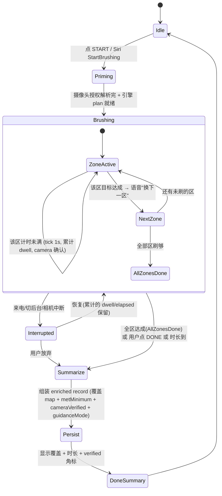
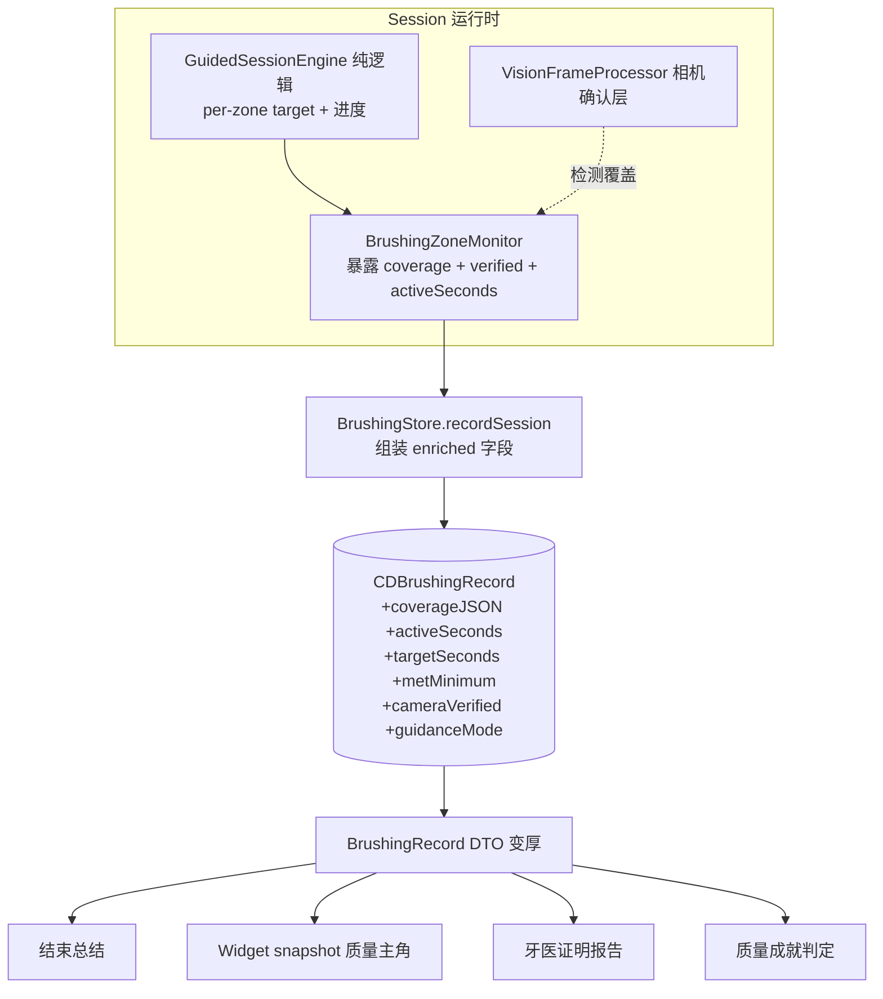

# feat: ToothBuddy quality-pivot rebuild (Phase 1)

## Summary

把 ToothBuddy 的内核从"习惯打卡"重做成"提升每次刷牙的质量 + 时长 + 可验证记录"：结构化的规定路线 audio-first session、变厚的刷牙记录（分区覆盖 + 时长 + 相机佐证标志）、去掉 kid/adult 硬区分改成设置开关、砍掉多档案家庭改成单机主、奖励 / Widget / Siri / HealthKit / Live Activity 重指向质量、牙医证明离线导出。全程本地、不碰后端。联网分享留 Phase 2。

origin: `docs/product-north-star.md`（产品权威定义）。

---

## Problem Frame

现有 app 是按"养成早晚刷牙习惯"做的：session 只是个数到用户喊停的计时器（没有 2 分钟硬停、没有真正的达标概念），记录只有 start/end 两个时间戳，奖励和 Widget 全绕着 streak 转，还有一整套"一家人共用一台手机"的多档案 / 家庭层。

用户重新定义了产品：大部分人早晚刷两次的习惯已经有了，真正的痛点在**每一次刷得好不好、够不够久**，以及把它变成**可给牙医看的证据**。这要求 session 变成结构化的分区引导（确保覆盖 + 时长）、记录变厚（覆盖 map + 时长 + 相机佐证）、奖励改绑质量、多档案家庭删掉换成个人 + 联网分享。

好消息是这不是从零重写：Core 纯逻辑层（`SessionScript` 分区 cue 时间线、`ZoneGuidance` 里 `GuidanceDecider` 的 `.fallbackTimed`/`.camera` 双模式、`ZoneCoverageTracker` 已在累计每区 dwell、`StreakEngine`）大部分可复用，砍多档案是净删除。最大的真改动是记录 schema 变厚 + session 从自由计时变成规定路线。

App Store 上架已暂停（`docs/product-north-star.md` 非目标节）。无真实用户 → 数据按 greenfield 处理。

---

## Requirements

### 质量 + 时长内核
- R1. session 走规定路线：app 驱动一个固定分区序列，每个区有目标时长，到点提示换下一个区，所有区刷够目标 + 总时长达标即 `metMinimum`。不要摄像头也能跑完全程。
- R2. 目标时长可配置（默认 120s，可选 180s），按区均分。
- R3. 每条刷牙记录持久化：`activeSeconds`（实际在刷的时间）、分区覆盖 map（每区 dwell 秒）、`targetSeconds`、`metMinimum`、`cameraVerified`、`guidanceMode`。
- R4. `cameraVerified` 诚实：仅当整场摄像头授权 + 检测到人脸/刷牙达到阈值才为 true，否则记 guided-only。

### Session 呈现
- R5. audio-first 免眼：全程语音引导（开场 / 每区 / 鼓励 / 收尾），不看屏也能完成；纯音频模式（屏幕熄或手机在兜里）可用。
- R6. 智能镜可选视觉模式：自拍画面 + 当前该刷的区高亮 + 进度 + 糖虫游戏，给愿意架手机的用户。
- R7. 结束总结显示：哪些区达标、总时长达标、verified/guided 角标；**不**显示"质量分"数字。

### 去区分 + 设置
- R8. 新 Settings 界面提供逐项 toggle：刷牙游戏 / 庆祝星星彩纸 / 内容 tone（playful·essentials）/ 等级与成就 / 习惯曲线 / 语音引导 / session 模式（audio·智能镜）/ 目标时长 / Apple Health 连接。默认全开。
- R9. 移除所有按 profile `mode`（kid/adult）的行为分叉，改由 Settings toggle 驱动。

### 单 profile
- R10. 单一机主 profile：首启自动创建，无档案选择器、无切换器、无首启选档 gate。
- R11. 删除家庭 / Group 整层：`GroupDashboardView` / `GroupStore` / `DashboardMetrics` / `CDGroup` + 关系 / Family tab / `allRecords()`。

### 奖励 + Apple 集成重指向
- R12. 奖励绑质量 / 时长 / 覆盖（达标 session、全区覆盖、相机佐证 session 等成就）；streak 保留但降级、不绑奖励。
- R13. Widget 主角改成今日质量状态（达标 / 覆盖），streak 降为次要角标。
- R14. Siri "我的 streak" 改播报质量指标；HealthKit 写入映射 `metMinimum`（不再无脑 `isCompleted: true`）；Health 授权入口去掉 adult-gate；quickLog 写的合成 session 标 guided-only/unverified。
- R15. Live Activity 的 `zoneHint` 带分区进度；`profileName` 用机主名。

### 牙医证明 + 收尾
- R16. 牙医证明离线导出（PDF / 可分享）含每次时长 / 覆盖 / verified 标志 + 30/90/365 天达标率，清楚区分 verified vs guided（反作弊）。
- R17. 清理：删除旧 JSON→CoreData 迁移代码；旧文档（`ROADMAP.md`/`PLAN.md`/`specs/`/`feature-inventory.md`）标记为被 `product-north-star.md` 取代；更新 `project.yml` 文件清单 + `README.md`。

### 贯穿约束
- R18. 维持 0 warning（Swift 6 strict-concurrency + `SWIFT_TREAT_WARNINGS_AS_ERRORS`）；Core `swift test` + app `xcodebuild test` 全绿；新增纯逻辑走 TDD。基线 108 Core + 42 app。

---

## Key Technical Decisions

- **保留单个 `CDProfile` 当机主身份锚，不彻底删 profile 概念。** records/achievements/care 的 `profile` 关系全部保留、只是永远一个 owner。理由：删 profile 关系是大面积改动且无收益；单 owner 直接做 Phase 2 联网身份的锚点。`ProfileStore` 收敛成"持有 + 自动创建 owner"，去掉 list / 切换 / 选档。

- **覆盖单位沿用现有 6 个 `CoarseZone`**（`ZoneGuidance.swift`：upperLeft/Right、lowerLeft/Right、frontTop/Bottom）。Vision adapter 已经映射到它。规定路线按 `CoarseZone.allCases` 固定序遍历，每区 `targetSeconds = target / 6`。不引入新的分区粒度。

- **覆盖 map 的持久化用一个 JSON string 属性**存 `[CoarseZone.rawValue: Double]`，挂在 `CDBrushingRecord` 上（optional → CloudKit 安全、零损）。不为每个区建独立属性（6 个属性太碎），也不上 transformable（CloudKit 兼容性更稳的是 string）。

- **规定路线引擎复用现有 Core 双模式。** `GuidanceDecider.fallbackTimed`（已实现的盲走、每 `zoneInterval` 换区）当"规定路线"驱动的基础，扩成带 per-zone 剩余目标 + 进度 + 达标判定的纯 `GuidedSessionEngine`；`.camera` 模式当确认层（steer 到 leastCovered + 记录检测覆盖）。

- **语音引导收敛到单一来源。** 现在 BrushView 双源发 quadrant 提示（`zoneMonitor.currentZone` 的 onChange + `SessionScript` 的 quadrant cue 是死的）。新方案：全程引导由引擎 → `SessionScript`（重新激活 intro/zone/encourage/wrap）→ `VoiceCoach` 单链路驱动，停掉 monitor 直接 speak。

- **`cameraVerified` 判定**：整场 camera authorized + Vision 检测到 face/brushing 的样本占比 ≥ 阈值（如 50%）。低于阈值或没开相机 → guided-only。判定逻辑做成 Core 纯函数可测。

- **Settings 用一个集中 `PreferencesStore`**（`@AppStorage`/UserDefaults 后端，`ObservableObject`）。吸收现有散落项：`voiceCoachMuted`、`ContentHistoryStore` 的 `contentTone`/`setTone`（已有 API 没 UI）；新增 §R8 的 toggle。

- **kid/adult `mode` 列与 `ProfileMode` enum 留作 dead（零风险）**，只移除所有读 `mode` 做 gating 的代码。理由：greenfield 下删 schema 列也行，但留 dead column 对 Core Data/`NSPersistentCloudKitContainer` 改动风险最小；后续可清。

- **`CDGroup` 实体删除**：连 `CDProfile.group` 关系及其 inverse 一起干净移除。pre-CloudKit-launch 删实体无迁移风险。

- **删除旧 JSON→CoreData 迁移**（`BrushingStore.runMigrationIfNeeded` + `MigrationTransform` 调用 + legacy keys）。greenfield 无真实用户，迁移是死代码。

---

## High-Level Technical Design

### 规定路线 session 状态机

要点：metMinimum = 所有区刷够各自目标 **且** 总 activeSeconds ≥ targetSeconds。用户提前点 DONE 也照样持久化一条记录，只是 metMinimum=false、覆盖 map 反映实际刷到哪。纯音频模式下没有 camera 确认 → cameraVerified=false，覆盖来自引擎的"规定路线假设达成"（guided-only）。

### 记录变厚的数据流

---

## Scope Boundaries

### 本 plan 内（Phase 1，全本地）
质量 / 时长 / 可验证记录内核、规定路线 audio-first session + 智能镜模式 + 结束总结、去 kid/adult 区分 + Settings、单 profile + 删家庭层、奖励 / Widget / Siri / HealthKit / Live Activity 重指向、牙医证明离线导出、收尾清理。

### Deferred to Follow-Up Work（Phase 2，联网，本 plan 不展开）
- 用户身份 / 账号系统。
- CloudKit 共享 zone 或自建后端。
- 牙医分享链接（在线、可由牙医打开）。
- 朋友 / 家人双向实时可见（社交圈）。
- CloudKit 多端同步（`NSPersistentCloudKitContainer` 已 ready，只差 `cloudKitContainerOptions` + entitlements + 用户的 Apple-Dev 配置）。

### Outside this product's identity（非目标）
- 临床诊断 / 菌斑检测 / "质量分"数字。
- 硬件 / BLE / 电动牙刷。
- 一家人共用一台手机的多档案。
- App Store 上架推进（暂停，等核心重做完）。
- 视觉精修 / 内容资产中文化。

---

## Implementation Units

单元按 5 个里程碑分组（Phase 1）。里程碑内按依赖排序。

### Milestone A — 数据 + 引擎地基（纯逻辑 + 持久化）

#### U1. 记录 schema 变厚（Core + Core Data）

- **Goal:** `BrushingRecord` DTO 与 `CDBrushingRecord` 增加质量 / 时长 / 覆盖 / 佐证字段，并更新映射。
- **Requirements:** R3, R4, R18
- **Dependencies:** 无
- **Files:**
  - `ToothBuddyCore/Sources/ToothBuddyCore/BrushingRecord.swift`（加字段 + 派生 `metMinimum`）
  - `Persistence.swift`（`CDBrushingRecord` 新 optional 属性 + `build()` 里 attr 定义 + `toDTO()` 映射）
  - `ToothBuddyCore/Tests/ToothBuddyCoreTests/BrushingRecordTests.swift`（新建或扩充）
- **Approach:** `BrushingRecord` 加 `activeSeconds: Int`、`targetSeconds: Int`、`coverage: [CoarseZone: Int]`（每区 dwell 秒）、`cameraVerified: Bool`、`guidanceMode: GuidanceMode`。`metMinimum` 做成派生属性（所有区 ≥ 各区目标 且 activeSeconds ≥ targetSeconds）。Core Data 侧加 `activeSeconds`/`targetSeconds`（Int64 optional）、`coverageJSON`(String optional)、`cameraVerified`(Bool optional default false)、`guidanceMode`(String optional)。`toDTO()`/`apply` 编解码 coverageJSON。沿用 `starCount` 兼容旧 UI 直到 U6 改掉。保持 `Codable` 向后兼容（新字段给默认值）。
- **Patterns to follow:** 现有 `attr(...)` helper + optional/defaulted 规则（`Persistence.swift:58-138` 的 CloudKit 安全注释）；`CDBrushingRecord.toDTO()`（`Persistence.swift:254-259`）。
- **Test scenarios:**
  - `metMinimum` 为 true：所有 6 区 dwell ≥ 各区目标 且 activeSeconds ≥ targetSeconds。
  - `metMinimum` 为 false：一个区 dwell 不足。
  - `metMinimum` 为 false：所有区够但 activeSeconds < targetSeconds（边界 target-1）。
  - coverage map 编码→解码 round-trip 相等（含空 map、含全 6 区）。
  - 旧 `Codable` JSON（无新字段）解码：新字段取默认值，不崩。
  - `durationSeconds`/`starCount` 现有行为不回归。
- **Verification:** Core `swift test` 全绿；新字段在 round-trip 与边界用例下行为正确。

#### U2. 规定路线 session 引擎（Core 纯逻辑）

- **Goal:** 一个纯、确定性的引擎：给定目标时长 + 已过时间 + （可选）相机 estimate，输出当前该刷的区、该区剩余、整体进度、是否达标，并累计覆盖。
- **Requirements:** R1, R2, R4, R18
- **Dependencies:** U1
- **Files:**
  - `ToothBuddyCore/Sources/ToothBuddyCore/GuidedSessionEngine.swift`（新建）
  - `ToothBuddyCore/Sources/ToothBuddyCore/ZoneGuidance.swift`（复用 `GuidanceDecider` / `ZoneCoverageTracker`，必要时扩 per-zone target）
  - `ToothBuddyCore/Tests/ToothBuddyCoreTests/GuidedSessionEngineTests.swift`（新建）
- **Approach:** 定义 `SessionPlan`（targetSeconds + 按 `CoarseZone.allCases` 的 per-zone 目标）与 `SessionProgress`（currentZone、当前区剩余、各区已达成、整体 0–1、metMinimum、cameraVerified 估计）。引擎 `advance(elapsed:estimate:coverage:)` 纯函数：规定路线推进（复用 `GuidanceDecider.fallbackTimed` 的换区节奏，但改成"刷够该区目标才换"而不是固定 15s）；camera 模式下用 `ZoneCoverageTracker` 累计检测 dwell 并 steer。`cameraVerified` 估计 = 有效检测样本占比 ≥ 阈值（纯函数 `CameraVerification.decide`）。
- **Patterns to follow:** `GuidanceDecider.decide`（`ZoneGuidance.swift:135-166`，纯 + 无隐藏状态，state 显式传入返回）；`ZoneCoverageTracker`（`ZoneGuidance.swift:100-115`）；`SessionScript` 的确定性 + 稳定排序（`SessionScript.swift`）。
- **Test scenarios:**
  - 规定路线：无相机、纯按时间，遍历 6 区，每区刷够目标后才推进到下一区。
  - 目标时长 120s：每区目标 = 20s；180s：每区 30s。
  - 全区达成 → progress=1、metMinimum=true。
  - 提前结束（elapsed < target）→ metMinimum=false，覆盖反映实际。
  - camera 模式：steer 到 leastCovered；某区已超目标不再被选。
  - `cameraVerified`：检测样本占比 ≥ 阈值 → true；纯音频（0 检测）→ false；占比刚好低于阈值 → false。
  - 确定性：同输入多次调用输出一致。
- **Verification:** Core `swift test` 全绿；引擎在规定路线 / 相机两模式下行为符合上述。

#### U3. Monitor 暴露覆盖 + 佐证 + 有效时间，并写入记录

- **Goal:** `BrushingZoneMonitor` 把已在内部累计的覆盖、camera-verified 估计、activeSeconds 暴露出来，`BrushingStore.recordSession` 接收并持久化。
- **Requirements:** R3, R4
- **Dependencies:** U1, U2
- **Files:**
  - `BrushingZoneMonitor.swift`（暴露 `coverage`/`cameraVerified`/`activeSeconds`/`guidanceMode`；接入 `GuidedSessionEngine`）
  - `BrushingStore.swift`（`recordSession` 改签名接收 enriched 字段；`quickLogForCurrentSlot` 标 guided-only/unverified）
  - `Tests/ToothBuddyAppTests/BrushingStoreTests.swift`（扩充）
- **Approach:** Monitor 持有 `ZoneCoverageTracker` + verified 估计 + activeSeconds（已在 `tick()` 算）；新增只读暴露。`BrushingStore.recordSession(start:end:coverage:activeSeconds:targetSeconds:cameraVerified:guidanceMode:)`。`quickLogForCurrentSlot` 写合成 session：coverage 空、cameraVerified=false、guidanceMode=guided-only、metMinimum 按时长。
- **Patterns to follow:** `BrushingZoneMonitor` 现有 `@Published currentZone`/`isBrushingActive` 暴露；`recordSession`（`BrushingStore.swift:97-111`）；`quickLogForCurrentSlot`（`BrushingStore.swift:117-139`）。
- **Test scenarios:**
  - `recordSession` 持久化全部 enriched 字段并能读回（toDTO round-trip）。
  - quickLog 写的记录 cameraVerified=false、guidanceMode=guided-only。
  - quickLog 同 slot 幂等性不回归（现有测试保持绿）。
  - 覆盖 map 从 monitor 传到记录无丢失。
- **Verification:** app `xcodebuild test` 全绿；新记录字段在真机/模拟 session 后非空（device smoke）。

---

### Milestone B — Session 体验（核心）

#### U4. 规定路线 + 全程 audio 引导的 session 控制器

- **Goal:** BrushView 的 session 从"自由数秒到喊停"改成引擎驱动的规定路线 + 真·达标，语音全程引导收敛到单一来源。
- **Requirements:** R1, R5, R2
- **Dependencies:** U2, U3
- **Files:**
  - `BrushView.swift`（`startBrushing`/`stopBrushing`/timer 重做，接 `GuidedSessionEngine`）
  - `VoiceCoach.swift`（必要时支持队列 / 防打断当前区提示）
  - `BrushingZoneMonitor.swift`（驱动引擎推进）
- **Approach:** 1s timer 改成把 elapsed + 当前 estimate 喂给引擎，拿 `SessionProgress` 驱动 UI + 语音。语音改由引擎 → `SessionScript`（重新激活 intro/zone/encourage/wrap）→ `VoiceCoach` 单链路；删掉 `onChange(of: zoneMonitor.currentZone)` 直接 speak 的第二来源。达标或用户 DONE → `stopBrushing` 收齐 enriched 字段调 `recordSession`。保留 Live Activity 调用（U14 再改内容）。
- **Patterns to follow:** 现有 `startBrushing`/`stopBrushing`（`BrushView.swift:509-592`）；`SessionScript.build`（`SessionScript.swift`）；`appSignposter` 区间（`BrushView.swift:512,569`）。
- **Execution note:** 引擎逻辑在 U2 已 TDD；本单元是 app 层接线，靠 device smoke 验证语音/计时手感。
- **Test scenarios:**
  - app 层可测：给定引擎进度序列，`recordSession` 收到的字段正确（注入 fake monitor/engine）。
  - 提前 DONE：记录 metMinimum=false、覆盖反映实际。
  - Test expectation（device smoke，非单测）：纯音频模式（屏幕不看）能靠语音走完 6 区；语音不重叠、不双源。
- **Verification:** app `xcodebuild test` 绿；device smoke：免眼跟语音可完成全程，达标判定正确。

#### U5. 三种 session 呈现模式 + 模式切换

- **Goal:** audio-first（免眼、屏幕最小）为底；智能镜（自拍 + 当前区高亮 + 进度 + 糖虫）为可选；可在 Settings/进入时切换。纯音频模式可用。
- **Requirements:** R5, R6
- **Dependencies:** U4, U7（读 Settings 的 session 模式 + 游戏开关）
- **Files:**
  - `BrushView.swift`（按模式条件渲染 camera/zone-highlight/progress/game vs 极简 audio 视图）
  - `BrushGameOverlay.swift`（去掉 `!isAdult`/tone gate，改 Settings 游戏开关）
- **Approach:** 读 `PreferencesStore.sessionMode`（audio / mirror）。audio 模式：极简进度环 + 当前区文字 + 静音键，相机不开。mirror 模式：现有 camera 预览 + 当前区高亮 + 进度 + （若游戏开关开）糖虫。糖虫 overlay 的显示条件从 `!isAdult && tone==.playful` 改成 `prefs.gameEnabled`。
- **Patterns to follow:** 现有 `cameraSection`（`BrushView.swift:278-397`）的条件渲染；`BrushGameOverlay` 接 `BrushingZoneMonitor`。
- **Test scenarios:**
  - Test expectation: none —— 纯呈现/条件渲染，靠 device smoke（两模式切换、糖虫开关生效）。
- **Verification:** device smoke：audio 模式不开相机也能用；mirror 模式自拍 + 高亮 + 进度正常；游戏开关控制糖虫。

#### U6. 结束总结重做（覆盖 + 时长 + verified 角标）

- **Goal:** `DoneResultSheet` 从"星星 + kid/adult 分叉"改成显示覆盖 map（哪些区达标）、总时长达标、verified/guided 角标；不显示质量分。
- **Requirements:** R7, R9
- **Dependencies:** U1, U3
- **Files:**
  - `BrushView.swift`（`DoneResultSheet` 重写，去 `isAdult` 参数 + `adultSlotSummary`）
- **Approach:** 用 enriched record 渲染：6 区小图标（达标绿 / 未达标灰）、`MM:SS` + 达标 ✓/✗、verified-by-camera 角标（盾形）或 guided-only 标记。星星 / 庆祝改由 `prefs.celebrationsEnabled` 控制（不再 by mode）。文案去掉 kid/adult 分叉。
- **Patterns to follow:** 现有 `DoneResultSheet`（`BrushView.swift:596-728`）的 Duo 卡片样式。
- **Test scenarios:**
  - Test expectation: none（纯展示）—— 但若把"覆盖→图标状态"映射抽成小纯函数则测：6 区各达标/未达标 → 正确图标集合；verified=true/false → 正确角标。
- **Verification:** device smoke：总结正确反映这次 session 的覆盖 / 时长 / 佐证。

---

### Milestone C — 去区分 + 单 profile

#### U7. 全新 Settings 界面 + PreferencesStore

- **Goal:** 集中的设置界面与偏好 store，提供 R8 的逐项 toggle，吸收现有散落偏好。
- **Requirements:** R8
- **Dependencies:** 无（但 U5/U6/U8 依赖它）
- **Files:**
  - `PreferencesStore.swift`（新建，`ObservableObject` + `@AppStorage`/UserDefaults）
  - `SettingsView.swift`（新建）
  - `ContentView.swift`（加 Settings 入口，复用原 profile 头像位）
  - `VoiceCoach.swift`（`isMuted` 迁到 / 桥接 PreferencesStore）
  - `ContentHistoryStore.swift`（`contentTone` 由 Settings 驱动，去掉 mode 派生默认）
  - `Tests/ToothBuddyAppTests/PreferencesStoreTests.swift`（新建）
- **Approach:** `PreferencesStore` 集中 key：`gameEnabled`、`celebrationsEnabled`、`contentTone`、`showLevelAchievements`、`showHabitCurve`、`voiceEnabled`、`sessionMode`、`targetSeconds`、`healthConnectEnabled`。全默认开 / playful / mirror / 120。`SettingsView` 分组列出。吸收 `voiceCoachMuted`（反向→voiceEnabled）、`ContentHistoryStore.contentTone`。
- **Patterns to follow:** `VoiceCoach` 的 `@Published`+UserDefaults didSet（`VoiceCoach.swift:10-18`）；`ContentHistoryStore` 的 UserDefaults 后端。
- **Test scenarios:**
  - 默认值：全新装 → 所有 toggle 取规定默认。
  - 持久化：设值 → 重建 store → 读回一致。
  - `targetSeconds` 仅接受 120/180。
  - tone 设值不再被 profile mode 覆盖。
- **Verification:** app test 绿；Settings 改值即时影响 session（device smoke）。

#### U8. 移除 kid/adult gating

- **Goal:** 删掉所有按 `mode` 的行为分叉，改读 PreferencesStore。
- **Requirements:** R9
- **Dependencies:** U7
- **Files:**
  - `BrushView.swift`（删 `isAdult`/`adultSlotSummary`；游戏/tone/总结改读 prefs —— 与 U5/U6 协同）
  - `HistoryView.swift`（`levelCard`/`achievements` 由 `showLevelAchievements`；`HabitCurveView` 由 `showHabitCurve`；`HealthConnectRow` 去 gate —— `HistoryView.swift:9-80`）
  - `ContentHistoryStore.swift`（删 `effectiveTone(forAdult:)` 的 mode 派生 —— `ContentHistoryStore.swift:31-34`）
- **Approach:** 逐点把 `isAdult` 分支替换成对应 prefs toggle。`HealthConnectRow` 从 `if isAdult` 移出，常显（受 `healthConnectEnabled`）。习惯曲线（原 adult-only）现在任何人可开。
- **Patterns to follow:** agent 枚举的精确 gate 点（见 north-star / 本单元 Files 行号）。
- **Test scenarios:**
  - Test expectation: none（条件渲染改写）—— 靠 U7 的 prefs 测 + device smoke：关游戏→无糖虫；关庆祝→无星星；开习惯曲线→显示。
- **Verification:** 全代码无 `mode == .adult`/`isAdult` gating 残留（grep 干净）；app test 绿。

#### U9. 收敛成单一机主 profile

- **Goal:** 首启自动创建机主 profile，去掉档案选择器 / 切换器 / 首启 gate。
- **Requirements:** R10
- **Dependencies:** 无（U10 依赖它）
- **Files:**
  - `ProfileStore.swift`（收敛：持有单 owner + 自动创建；去 list 语义 / `setActive` 多档案部分）
  - `MyApp.swift`（`RootView` 去掉 `ProfilePickerView(isGate:)` gate，改自动创建 —— `MyApp.swift:60-63`）
  - `ContentView.swift`（去 profile 切换器 sheet + `profileButton`，头像位改 Settings 入口 —— `ContentView.swift:16,41-45,97-107`）
- **Approach:** `ProfileStore` 启动若无 profile 则建一个默认 owner（名字可后续 Settings 改）。`activeProfile` 永远非 nil。删 `RootView` 的 gate 分支。`ContentView` 头像点击改打开 Settings（U7）。`ProfilePickerView` 大部分删（U10 处理），可留 `CreateProfileView` 的 name/color/avatar 卡给 owner 编辑（去 modeCard）。
- **Patterns to follow:** `ProfileStore.reload` 的 auto-select-if-single（`ProfileStore.swift:36-40`）已接近单档案。
- **Test scenarios:**
  - 全新装：自动创建一个 owner，`activeProfile` 非 nil。
  - 重启：复用同一 owner，不重复创建。
  - 不再有"无 profile"状态。
- **Verification:** app test 绿；首启直接进主界面无选档（device smoke）。

#### U10. 删除家庭 / Group 整层

- **Goal:** 净删除多档案家庭层及其 Core Data 实体。
- **Requirements:** R11
- **Dependencies:** U9
- **Files（删除）:** `GroupDashboardView.swift`、`GroupStore.swift`、`ToothBuddyCore/Sources/ToothBuddyCore/DashboardMetrics.swift`（+ 其测试）
  - `ContentView.swift`（删 `AppTab.family` case + tab + label —— `ContentView.swift:3-8,132-139,155,237,246`）
  - `BrushingStore.swift`（删 `allRecords()` —— `BrushingStore.swift:88-92`）
  - `Persistence.swift`（删 `CDGroup` 类 + 实体 + `CDProfile.group` 关系及 inverse —— `Persistence.swift:23-30,99-101,133-138,165-178`）
  - `ProfilePickerView.swift`（删切换器；salvage 部分见 U9）
- **Approach:** 删文件 + 引用。profile-scoped fetch 谓词（`BrushingStore.swift:75`、`GamificationStore.swift:159`）单 owner 下仍可工作，先保留（可后续简化）。`ProfileScopedAggregator` 单 profile 下变恒等，保留无害。`project.yml` 文件清单同步删（U16 统一，或本单元就改）。
- **Patterns to follow:** agent 枚举的删除点。
- **Test scenarios:**
  - 删 `DashboardMetrics` 测试随之移除；其余 Core/app test 仍全绿。
  - 无 Family tab、无 group 引用编译残留。
- **Verification:** `xcodegen generate` + `bash scripts/audit.sh` 全绿、0 warning；无 group/family 符号残留。

---

### Milestone D — 奖励 + Apple 集成重指向

#### U11. 奖励重指向质量 / 时长 / 覆盖

- **Goal:** 成就 / 等级改绑质量指标；streak 保留但降级、不绑奖励。
- **Requirements:** R12
- **Dependencies:** U1, U3
- **Files:**
  - `GamificationStore.swift`（成就集 + `checkAndUnlock` + level 重定义 —— `GamificationStore.swift:43-153`）
  - `ToothBuddyCore/Sources/ToothBuddyCore/`（若把达标/覆盖判定抽纯函数）
  - `Tests/ToothBuddyAppTests/GamificationStoreTests.swift`（改写）
- **Approach:** 新成就：首次达标 session、全 6 区覆盖、刷够 2 分钟、首个 camera-verified session、N 个达标 session、连续达标。移除 / 降权纯 streak 成就（streak-3/streak-7 可保留为温和项但不再是主线）。level 由"达标 session 数"而非 raw 数。streak 仍由 `StreakEngine` 算、UI 降级展示。
- **Patterns to follow:** 现有 `allAchievements` + `checkAndUnlock` + `consider(...)`（`GamificationStore.swift:79-153`）。
- **Test scenarios:**
  - 一条达标 record（全区 + 时长）→ 解锁"达标"/"全区"/"2 分钟"成就。
  - 未达标 record → 不解锁达标类。
  - camera-verified record → 解锁 verified 成就；guided-only → 不解锁。
  - level 随达标 session 数阶梯变化（边界值）。
  - 解锁的 per-profile 隔离不回归（现有测试保持绿）。
- **Verification:** Core + app test 绿；成就只被质量/时长/覆盖触发。

#### U12. Widget 重指向质量

- **Goal:** `WidgetSnapshot` 加质量字段，`StreakWidget` 主角改今日质量状态、streak 降次要。
- **Requirements:** R13
- **Dependencies:** U1, U3
- **Files:**
  - `ToothBuddyCore/Sources/ToothBuddyCore/WidgetSnapshot.swift`（加字段 + builder）
  - `Widget/StreakWidget.swift`（重排版）
  - `WidgetBridge.swift` / `AppGroupBridge.swift`（写新 snapshot）
  - `ToothBuddyCore/Tests/ToothBuddyCoreTests/WidgetSnapshotTests.swift`
- **Approach:** snapshot 加 `todayMetMinimumCount`、`todayActiveMinutes`、`lastSessionCoveragePct`、`lastSessionVerified`。Widget 小号主显今日达标状态 + 覆盖；中号加趋势；streak 缩成小角标。builder 吃 enriched records。
- **Patterns to follow:** 现有 `WidgetSnapshotBuilder.build`（`WidgetSnapshot.swift:32-58`）+ `StreakEngine` 调用。
- **Test scenarios:**
  - builder 从 enriched records 算出今日达标数 / 活跃分钟正确。
  - snapshot Codable round-trip（含新字段）。
  - 无记录 / 仅 guided-only 记录的边界。
- **Verification:** Core test 绿；Widget 显示质量为主（device smoke）。

#### U13. Siri + HealthKit 重指向

- **Goal:** streak 语音意图改播报质量；HealthKit 映射 metMinimum；Health 授权去 gate；quickLog 标 unverified。
- **Requirements:** R14
- **Dependencies:** U1, U3, U8
- **Files:**
  - `ToothBuddyIntents.swift`（`BrushingStreakIntent` 改播报质量；`LogBrushingIntent` dialog 调整 —— `ToothBuddyIntents.swift:10-64`）
  - `HealthExporter.swift`（`exportIfNeeded` 用 metMinimum 而非恒 true —— `HealthExporter.swift:54-70`）
  - `BrushingStore.swift`（quickLog 已在 U3 标 unverified —— 确认）
  - `HistoryView.swift`（`HealthConnectRow` 去 gate —— 已在 U8）
- **Approach:** `BrushingStreakIntent` 改报"本周 N 次达标 / 今日是否达标"。HealthKit 仍写 `toothbrushingEvent`，但 isCompleted 入参改成 metMinimum（或同时记，但只对达标的标 completed）。
- **Patterns to follow:** 现有三个 intent（`ToothBuddyIntents.swift`）；`HealthExportDecider`（Core 纯）。
- **Test scenarios:**
  - `HealthExportDecider` / export 决策：metMinimum=true → 导出；false → 仍可导出但标记不同（按设计）—— 测决策纯函数。
  - quickLog 记录 unverified 不回归。
  - Test expectation（Siri 措辞）：device/manual smoke。
- **Verification:** app test 绿；Siri 播报质量、Health 写入随达标（manual smoke）。

#### U14. Live Activity 加分区进度

- **Goal:** Live Activity 内容从单纯倒计时 + zoneHint 改成带分区进度；profileName 用机主名。
- **Requirements:** R15
- **Dependencies:** U4
- **Files:**
  - `Shared/BrushingActivityAttributes.swift`（`ContentState` 加进度/覆盖字段）
  - `BrushingLiveActivity.swift`（`update` 传进度 —— `BrushingLiveActivity.swift:14-45`）
  - `Widget/BrushingLiveActivityWidget.swift`（渲染进度）
- **Approach:** `ContentState` 加 `zonesCompleted: Int`/`totalZones: Int`（或 progress 0–1）。`BrushView` session timer 里 update 传当前进度。
- **Patterns to follow:** 现有 `ContentState`（`BrushingActivityAttributes.swift:10-21`）+ `update`（`BrushView.swift:550-554`）。
- **Test scenarios:**
  - Test expectation: none（ActivityKit 只能真机验证）—— device smoke：锁屏/灵动岛显示分区进度。
- **Verification:** device smoke：进行中 session 锁屏显示分区进度，profileName 为机主。

---

### Milestone E — 牙医证明 + 收尾

#### U15. 牙医证明离线导出

- **Goal:** 升级 PDF 报告成牙医证明：含每次时长 / 覆盖 / verified 标志 + 区间达标率，清楚区分 verified vs guided。
- **Requirements:** R16
- **Dependencies:** U1, U3
- **Files:**
  - `ToothBuddyCore/Sources/ToothBuddyCore/ReportBuilder.swift`（`ReportData` 加质量字段）
  - `ReportPDFRenderer.swift`（渲染覆盖 / 达标 / verified）
  - 入口：`HistoryView.swift` 或 `SettingsView.swift`（原来在 `GroupDashboardView`，已删 → 迁出）
  - `ToothBuddyCore/Tests/ToothBuddyCoreTests/ReportBuilderTests.swift`
- **Approach:** `ReportBuilder.build` 吃 enriched records，输出：区间内 session 数、达标率、平均时长、覆盖热度、verified vs guided 计数。PDF 加一节"verified by camera: X / N sessions"，把 guided-only 明确标出（反作弊）。日历网格保留，颜色按达标。
- **Patterns to follow:** 现有 `ReportBuilder.build`（`ReportBuilder.swift:45-51`）+ `ReportPDFRenderer`（`UIGraphicsPDFRenderer`）。
- **Test scenarios:**
  - 区间过滤（30/90/365 天）正确。
  - 达标率 = 达标 session / 总 session（含 0 session、全达标、全未达标边界）。
  - verified vs guided 计数正确。
  - 覆盖热度聚合正确。
- **Verification:** Core test 绿；PDF 含质量数据 + verified 区分（manual smoke 看 PDF）。

#### U16. 清理 + 文档

- **Goal:** 删死代码、旧文档标记取代、project.yml + README 同步。
- **Requirements:** R17, R18
- **Dependencies:** U1–U15
- **Files:**
  - `BrushingStore.swift`（删 `runMigrationIfNeeded` + legacy keys —— `BrushingStore.swift:168-201`）
  - `ToothBuddyCore/Sources/ToothBuddyCore/Migration.swift`（评估删除 / 保留）
  - `project.yml`（删已删文件、加新文件到 app/widget target 显式清单）
  - `docs/feature-inventory.md`（删或加 superseded 头）、`ROADMAP.md`/`PLAN.md`（加 superseded-by north-star 头）、`specs/`（标 legacy）
  - `README.md`（更新定位）
- **Approach:** 删 JSON 迁移链路（greenfield）。旧规划文档加一行"superseded by docs/product-north-star.md (2026-05-29)"而非全删（保留历史）。`project.yml` 同步新增/删除的 source 文件（XcodeGen 显式清单，不 glob）。
- **Patterns to follow:** `project.yml` 现有显式 file list（不 glob）。
- **Test scenarios:**
  - Test expectation: none —— 删死代码后 `bash scripts/audit.sh` 全绿、0 warning 即验证。
- **Verification:** `xcodegen generate` + `bash scripts/audit.sh` 全绿 0 warning；无迁移死代码引用；旧文档有 superseded 标记。

---

## Risks & Dependencies

- **相机确认层在真机才能调准。** Vision 的左右/上下映射（`VisionFrameProcessor` 的 mirrorX/flipY）以及 `cameraVerified` 阈值，单测/模拟器测不了，必须真机 smoke（这是旧 P4.2 一直 pending 的项，现在对"相机佐证"更关键）。引擎纯逻辑可测，但手感与佐证准确性靠真机。
- **session 从自由计时改成规定路线是行为大改**，影响 BrushView 主流程 + Live Activity + 总结 + 记录。U4 是最大单元，建议先把 U2 引擎 TDD 扎实再接线。
- **Core Data schema 改动在 `NSPersistentCloudKitContainer` 上。** 加 optional 属性零损 + CloudKit 安全；删 `CDGroup` 实体 pre-launch 无迁移风险，但要连关系 inverse 干净删，避免模型加载断言失败（`Persistence.swift:212-213`）。
- **greenfield 假设**：删 JSON 迁移、可随意改 schema 的前提是无真实用户。若已有 TestFlight 安装需保留数据，则 U1/U16 要改成保迁移——当前判断是无真实用户。
- **依赖顺序**：A（U1→U2→U3）是地基，B/D/E 都依赖记录变厚 + 引擎；C（U7→U8、U9→U10）相对独立可并行；U5 依赖 U7。建议里程碑顺序 A → C(U7) → B → C(剩余) → D → E，但 A 必须最先。
- **0 warning 红线**：Swift 6 strict + warnings-as-errors，每个单元后 `bash scripts/audit.sh` 必须保持绿（R18）。

---

## Phase 2（勾勒，本 plan 不展开）

联网身份 + 分享，需要单独 plan：用户账号 / 身份；CloudKit 共享 zone 或自建后端；牙医在线分享链接；朋友 / 家人双向实时可见。`NSPersistentCloudKitContainer` 已 ready，CloudKit 多端只差 `cloudKitContainerOptions` + entitlements + 用户的 Apple-Dev 配置。
