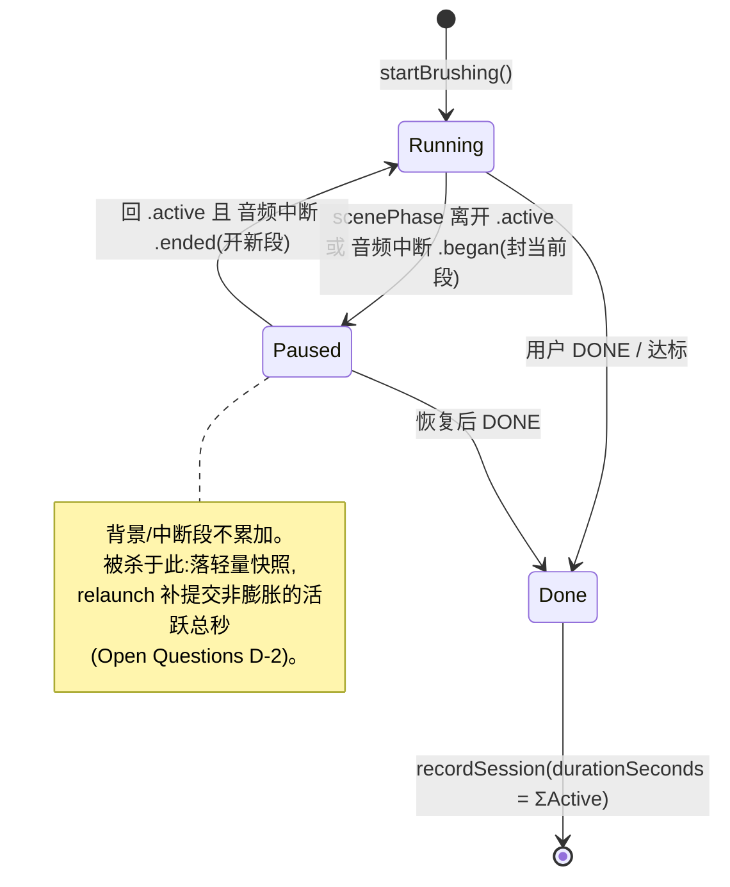

# feat: ToothBuddy Phase 1.5 — 本地闭环打磨(可真机 test 形态)

## Summary

把 Phase 1(quality-pivot rebuild,U1–U16,已完成)推到"用户能拿真机端到端跑一遍"的状态。四件事:(A1)把通过测试 + 过了 code review 的 Phase 1 合进 `main`、拿到干净基线;(A2)补 north-star 唯一明确缺的 onboarding"主要给谁用"可选预设 —— **只设默认值,绝不复活 kid/adult 行为分叉**;(A3)补齐单测/模拟器能覆盖的降级与边界路径,重点是修掉 session 在中断/后台时计时膨胀这个数据完整性 bug —— **显示路径和持久化路径都要修干净,且要覆盖不改 scenePhase 的音频中断**;(A4)交付一份"只有真机能验"的 smoke checklist。

全程本地、不碰后端、不碰 Phase 2 联网。设计上把每个可判定的逻辑推到 `ToothBuddyCore` 纯函数层,让新增逻辑落进现有 116-test 体系、且不需要动 `project.yml`。

origin: `docs/product-north-star.md`(产品权威定义)。前序计划:`docs/plans/2026-05-29-001-feat-quality-pivot-rebuild-plan.md`(Phase 1,status: completed)。

---

## Problem Frame

Phase 1 代码完整、干净:Core `swift test` 116 全绿、app `xcodebuild test` 47 全绿、build 过 warnings-as-errors(0 warning,已 `bash scripts/audit.sh` 实测)。但有两个状态没发生:**PR #1 还开着没合 `main`(领先 19 commit)**;**整个 Phase 1 从未在真机验过**。

研究勘察(3 路 agent)+ 一轮多 persona doc-review 确认实现面后,暴露出几个"作为可上手 test 的完整产品"该补的洞:

1. **数据完整性洞(P0)。** `BrushView` 的 session 计时是裸 `Timer` + 墙钟差值(`elapsedSeconds = Int(Date().timeIntervalSince(start))`),且没有 `@Environment(\.scenePhase)` 监听。来电、切后台、被系统挂起时计时不暂停,把"用户没在刷"的时间也算进去。这个洞有三个面,缺一不可:**(a)** 显示/cue/Live Activity 走的 `elapsedSeconds`;**(b)** 真正持久化进记录的 `durationSeconds = endDate − startDate`(墙钟)+ 由它派生的 `starCount` —— 这条会直接出现在 HistoryView 与牙医 PDF,只修 (a) 不修 (b) 等于 P0 没修完;**(c)** 接电话 / Siri / 闹钟触发的 `AVAudioSession` 中断**不改 scenePhase**,只监听 scenePhase 会漏掉它(语音被系统静音而计时照涨)。

2. **相机降级洞(P1)。** 相机权限被拒(`.denied`/`.restricted`)时 `requestCameraIfNeeded()` 没有显式分支:mirror 模式下相机预览区**黑屏**、无提示。底层 `BrushingZoneMonitor` 已会自动进 `fallbackMode`(纯时间引导仍能跑完),所以缺的不是能力,是**诚实地告诉用户在跑纯音频**且别黑屏。另有一个竞态:用户在权限弹窗还没回答时就点 START,会被误判成 guided-only。

3. **收尾反馈洞(P1/P3)。** 牙医证明导出 `ReportPDFRenderer.writeTempPDF()` 失败时返回 `nil` → ShareSheet 不弹 → 用户体验是"按钮没反应"。零记录时 `ReportBuilder` 仍生成"看起来正常但全是 0"的 PDF,没有明确空态。(`HabitCurveView` 经核查已有空态占位,见 U5。)

4. **产品功能洞(north-star 要求)。** north-star 明确要求 onboarding 提供一个可选的"这台手机主要给谁用"预设,目前 `OnboardingView` 是 6 屏纯叙事、完全没碰 `PreferencesStore`。

只能真机验的(相机左右映射、`cameraVerified` 阈值手感、Live Activity、Siri、HealthKit 写入、TTS、音频中断行为)不在本计划用代码"解决",而是收进 A4 的 checklist 交给用户。

---

## Requirements

来源:用户拍板的 Phase 1.5 范围(A1–A4)+ `docs/product-north-star.md` + 研究勘察与 doc-review 暴露的具体缺口。

### A1 — 收尾 Phase 1
- R1. 把 PR #1 合进 `main`,合并后 `main` 上 `bash scripts/audit.sh` 全绿(116 Core + 47 app,0 warning)。Phase 1.5 从合并后的 `main` 起新分支。

### A2 — Onboarding 可选预设(north-star)
- R2. onboarding 流程提供一个**可跳过**的"主要给谁用"预设步骤,选择后批量写入 `PreferencesStore` 的默认值(进预设的字段:目标时长 / 内容 tone / 游戏 / 庆祝)。跳过则保持现有默认。
- R3. 预设**只设默认值**:不引入任何按使用者类型的运行时行为分叉,不写 `CDProfile.mode`(`ProfileMode` 维持 dead)。预设设的值等同于用户事后能在 Settings 里逐项改的那些 toggle。用户可见文案不得直接暴露代码标识或临床框架词。

### A3 — 边界 / 降级路径
- R4.(P0)session 时长只累计**前台、活跃且未被音频中断**的时间,**显示与持久化两条路径一致**:中断 / 切后台 / 音频被打断时暂停累计,恢复后续累,绝不把无效时间算进 `activeSeconds`、`durationSeconds`、`starCount`。切后台被杀不写膨胀记录;且不静默丢弃已刷的有效进度(见 Open Questions D-2)。
- R5.(P1)mirror 模式下相机不可用(被拒 / 受限 / 启动时未决)时,session 诚实降级到纯音频:显示明确提示(非阻塞、整场常驻)、不黑屏,且该次记录 `cameraVerified=false`、`guidanceMode` 反映为 guided-only;用户在权限弹窗未回答前点 START 不被误标。
- R6.(P1)导出牙医证明失败时给用户可见的错误反馈(有文案、有下一步),不再静默 no-op。
- R7.(P3)零记录 / 仅 guided-only 记录时,报告与曲线有明确、不崩、不误导的空态。

### A4 — 真机 smoke 交付物
- R8. 产出一份用户可执行的真机 smoke checklist,逐条列出只能真机验的项(相机左右/上下映射、`cameraVerified` 阈值手感、语音单源不重叠、Live Activity/灵动岛分区进度、纯音频免眼盲走、**接电话等音频中断后时长不膨胀**、相机被拒降级、HealthKit 写入随 `metMinimum`、Siri 播报质量、Widget 质量主角、onboarding 预设),每条含"怎么操作 / 期望看到什么 / 不对时记哪里"。

### 贯穿约束
- R9. 维持 0 warning(Swift 6 strict-concurrency + `SWIFT_TREAT_WARNINGS_AS_ERRORS`,三 target 全开);每个实现单元后 Core `swift test` + app `xcodebuild test` 全绿。基线 116 Core + 47 app(由 Phase 1 起始基线 108+42 增长而来),只增不减。新增纯逻辑走 TDD、放 `ToothBuddyCore`。
- R10. 新增逻辑优先抽成 Core 纯函数(模仿 `HealthExportDecider` / `CameraVerification`),app 层只喂事实输入。Core 文件 SwiftPM 自动 glob —— 本计划设计为**不新增 app-target 文件**,因而**不需要改 `project.yml`**(预设 slide 作为新 struct 加进现有 `OnboardingView.swift`;若实现中某文件过大需拆出新 app 文件,则同步 `project.yml` sources + `xcodegen generate`)。

---

## Key Technical Decisions

- **KTD-1:前台累计计时,显示与持久化两路都修(R4)。** 不再用"墙钟 − 开始时刻"算时长,改成累计**有效活跃段**时长:Core 纯 value type `SessionClock` 接收暂停/恢复转换的时间戳,只对有效段求和。`BrushView` 监听 `@Environment(\.scenePhase)` **以及** `AVAudioSession.interruptionNotification` —— 二者任一触发都封段、恢复后开新段。四个必须一起做的子项:
  - **(a) 暂停信号要双源。** 接电话 / Siri / 闹钟会中断音频但**不改 scenePhase**(session 仍 `.active`),只看 scenePhase 会漏 —— 语音已被系统静音而计时照涨,膨胀照旧。`BrushingZoneMonitor` 已观察 `AVCaptureSession` 中断,这里加观察 `AVAudioSession.interruptionNotification(.began/.ended)`。
  - **(b) 持久化路径也要改(否则 P0 没修完)。** 当前 `BrushingRecord.durationSeconds = max(0, Int(endDate − startDate))`(墙钟)、`recordSession(end: Date())`、`starCount` 由 `durationSeconds` 派生 —— 这条墙钟时长直接进 HistoryView 与牙医 PDF。U3 必须让持久化时长来自 `SessionClock` 活跃总秒(`recordSession` 传由活跃秒推导的 end,或把 `durationSeconds`/`starCount` 改读 active-derived 值),不只改 `elapsedSeconds`。沿用 `metMinimum` 已偏好 `activeSeconds` 而非墙钟的既有 pattern。
  - **(c) cue 触发改 `<=` 扫描。** 现在 cue 按 `cue.atSecond == elapsedSeconds` 精确匹配,只在每秒 +1 时安全;改成累计活跃秒后会非均匀步进(tick 被系统合并 / 恢复时一次跨 >1 秒),`==` 会**漏掉**那一秒的 cue(含唯一中段内容 cue)。改成"触发所有 `atSecond ≤ elapsedSeconds` 且未播过的 cue"(仍由 `spokenCueTimes` 去重)。
  - **(d) monitor 用 `paused` flag,不用 stop/start。** monitor 的 dwell / `activeSecondsCount` 也随暂停停,但 `stopMonitoring()` 会拆 Vision、移除 observer、清 `currentZone`,当暂停用太重且重置区状态;改成 `tick()` 里一个 `paused` 短路累加,与 `SessionClock` 同源暂停,保证"时长真相"与"覆盖真相"不分叉。
  - 暂停/恢复要给用户**可见信号**(见 U3),否则用户回前台会以为 app 崩了。被杀于后台的丢弃 vs 快照补提交见 Open Questions D-2。

- **KTD-2:相机不可用 → 显式降级到音频,不黑屏(R5)。** 引入 Core 纯函数 `SessionModeResolver.resolve(requested:authorization:) -> (effective, degraded)`:`(mirror, denied/restricted) → (audio, true)`、`(mirror, authorized) → (mirror, false)`、`(audio, *) → (audio, false)`。`BrushView` 用 **effective mode** 决定渲染。授权态用 Core 友好的 `CameraAuthorization` enum 表达,app 把 `AVAuthorizationStatus` 映射进来。`notDetermined` 且用户已点 START 的竞态:gate session 启动直到权限回调返回再解析,别在未决态把记录误标 guided-only。(此 resolver 仅 `BrushView` 一个调用方 —— 保留在 Core 是为可测 + 对齐既有纯函数约定,见 Open Questions D-3。)

- **KTD-3:预设是纯默认值注入,零行为分叉(R2/R3)。** Core 定义 `enum OnboardingPreset` + `Sendable` 的 `PreferenceDefaults` struct + 纯映射;`PreferencesStore` 加 `apply(_ defaults:)` 批量赋值(走现有 `@Published` + didSet → UserDefaults)。预设 slide 选中即 `prefs.apply(preset.defaults)`,跳过则不调用。**绝不触碰 `ProfileMode`。** 预设取值(易调,非硬约束):

  | 预设(case) | 用户可见文案(示意) | contentTone | gameEnabled | celebrationsEnabled | targetSeconds |
  |---|---|---|---|---|---|
  | `kid` | "给小朋友" | playful | true | true | 120 |
  | `adult` | "给我自己" | essentials | false | false | 120 |
  | `intensive` | "牙医让我认真刷"(牙套/反复蛀牙) | essentials | false | true | 180 |
  | (跳过) | "稍后自定义" | — | — | — | — |

  **case 名不带临床框架**(用 `intensive` 而非 `dentistFlagged`;north-star 明确避免被当临床指标),且 UI 文案走单独的 `displayName`、**绝不用 `rawValue`**。`sessionMode` 不进预设(维持现有 `.mirror` 默认);`showLevelAchievements` / `showHabitCurve` / `voiceEnabled` / `healthConnectEnabled` 不进预设(默认全开,降低预设认知负担)。

- **KTD-4:空态与导出失败显式化(R6/R7)。** `ReportBuilder` 输出加 `hasData` 布尔;`ReportPDFRenderer` 无数据时渲染明确"暂无记录"页(含一句去刷牙的引导)而非全 0 表;`HistoryView` 在 `writeTempPDF()` 返 `nil` 时弹 error alert(有标题 / 原因 / 下一步)。`HabitCurveView` 经核查已有 `pts.count >= 2` else 占位文案,本项是**验证可接受**而非新增 guard。

- **KTD-5:现在就合 `main`,Phase 1.5 起新分支(R1)。** Phase 1 已测试 + 过 code review,greenfield、`main` 不是发布线 —— 没理由让 19-commit 的 PR 烂掉或把两阶段耦成巨型合并。建议 merge-commit 保留 U1–U16 历史;偏好单条历史可 squash。真机若发现根本问题,本就是 Phase 1.5 的修复范围。

---

## High-Level Technical Design

### Session 计时的暂停/恢复状态机(KTD-1 / U3)

核心:`activeElapsed = Σ(每个有效活跃段的时长)`,无效段(背景 / 音频中断)不计入;显示用的 `elapsedSeconds` 与持久化的 `durationSeconds`/`starCount`/`activeSeconds` **全部**取自这一个真值。`BrushView` 把 scenePhase **与** AVAudioSession 中断转换喂给 Core `SessionClock`。

并发与联动:`BrushingZoneMonitor` 的 per-zone dwell / `activeSecondsCount` 用一个 `paused` flag 在 `tick()` 里短路累加(**不**用 `stopMonitoring()`,那会拆 Vision/清 zone),与 `SessionClock` 同源暂停。cue 派发由精确 `==` 改 `<=` 扫描,防非均匀步进时丢 cue。`SessionClock` 值类型标 `Sendable`,调用在 `@MainActor` 上下文。

### 相机降级的有效模式解析(KTD-2 / U4)

| requested `sessionMode` | `CameraAuthorization` | effective | degraded 提示 |
|---|---|---|---|
| mirror | authorized | mirror | 无 |
| mirror | denied / restricted | audio | 整场常驻"相机已关 — 正在纯音频引导" |
| mirror | notDetermined(START 已点) | 等权限回调再解析(短暂"准备中") | 取决于回调结果 |
| audio | 任意 | audio | 无 |

---

## Implementation Units

按合并 → 功能 → 硬化 → 交付排序。U1 是 ops 前置;U2–U5 彼此独立(都只依赖 U1),但 **U3、U4 都改 `BrushView.swift`,实现时注意先后接线避免互踩**;U6 收尾。

### U1. 合并 PR #1 到 main,建立 Phase 1.5 基线

- **Goal:** Phase 1 落地 `main`,从干净基线起 Phase 1.5 分支。
- **Requirements:** R1
- **Dependencies:** 无
- **Files:** 无源码改动(ops 单元)。
- **Approach:** 合并前在 `feat/quality-pivot-rebuild` 跑 `bash scripts/audit.sh` 确认全绿基线;经 PR #1 平台合并(merge-commit 优先,见 KTD-5);合并后在 `main` 复跑 audit 确认 116+47、0 warning;从 `main` 切 Phase 1.5 新分支承载 U2–U6。**这是一次 outward-facing、不易回退的操作 —— 执行前向用户确认时机(用户已确认"现在合"的策略)。**
- **Patterns to follow:** `scripts/audit.sh` 一站式校验。
- **Test scenarios:** Test expectation: none —— ops 单元,验证靠 audit 全绿。
- **Verification:** `main` 上 `bash scripts/audit.sh` 全绿(116 Core + 47 app,0 warning);Phase 1.5 分支已从 `main` 建立。

---

### U2. Onboarding "主要给谁用" 可选预设

- **Goal:** onboarding 加一个可跳过的预设步骤,选择后把一组默认值批量写入 `PreferencesStore`;跳过保持现有默认。
- **Requirements:** R2, R3, R9, R10
- **Dependencies:** U1
- **Files:**
  - `ToothBuddyCore/Sources/ToothBuddyCore/OnboardingPreset.swift`(新建:`enum OnboardingPreset` + `displayName` + `Sendable struct PreferenceDefaults` + 纯映射)
  - `ToothBuddyCore/Tests/ToothBuddyCoreTests/OnboardingPresetTests.swift`(新建)
  - `PreferencesStore.swift`(加 `apply(_ defaults: PreferenceDefaults)`)
  - `OnboardingView.swift`(在 Ready 屏前插入预设 slide,作为同文件新 struct;**改硬编码页码**)
  - `Tests/ToothBuddyAppTests/PreferencesStoreTests.swift`(扩充:apply round-trip + 持久化)
- **Approach:** `PreferenceDefaults` 只含进预设的字段(`contentTone`/`gameEnabled`/`celebrationsEnabled`/`targetSeconds`,见 KTD-3 表),`targetSeconds` 仅 120/180。`OnboardingPreset.defaults` 纯映射,`displayName` 给 UI 文案(不暴露 case 名/`rawValue`)。`PreferencesStore.apply` 顺序赋值现有 `@Published` 字段。**插入 slide 必须改 `OnboardingView` 的硬编码页码**:Ready 现 `.tag(5)`、`advance()` 钳到 `min(page+1, 5)`、Skip 跳 `page = 5`、圆点指示 `page >= 1 && page <= 4` —— 全部随新页 bump(Ready→`.tag(6)`、钳到 6、Skip 跳 6),否则 Skip / 滑到末尾会落在预设页或滑不到 Ready。新 slide 插在 Ready **之前**,不改 `hasCompletedOnboarding` gate 语义(仍由 Ready 屏 `onComplete` 触发)。**不碰 `ProfileMode`、不碰 owner profile 创建(其在 RootView init 已自动发生)。**
- **Patterns to follow:** Core 纯映射 + `String`-backed enum 模仿 `ContentTone`(`ToothBuddyCore/Sources/ToothBuddyCore/ContentEngine.swift`);`PreferencesStore` 现有 `@Published`+didSet→UserDefaults;app 测试用 `freshDefaults()` 注入隔离 suite(`Tests/ToothBuddyAppTests/PreferencesStoreTests.swift`);slide 复用 `OnboardingView.swift` 现有 slide struct 样式。
- **Test scenarios:**
  - `OnboardingPreset.kid/.adult/.intensive` 的 `.defaults` 各字段等于 KTD-3 表值。
  - 每个预设 `targetSeconds` ∈ {120, 180}。
  - `displayName` 对每个 case 非空,且 `rawValue`(若 `String`-backed)不作为任何用户可见文案来源(测断言 displayName ≠ 内部 case 名形态 / 不含 "dentist")。
  - `PreferencesStore.apply(bundle)`:所有字段被设为 bundle 值,重建 store(同一 suite)读回一致。
  - 跳过路径:不调用 `apply` 时 store 保持构造默认(playful/game on/celebrations on/120)。
  - 边界:`apply` 一个 `targetSeconds=180` 的 bundle 后,120/180 clamp 不回归。
- **Verification:** Core + app test 全绿;device smoke(U6):首启见预设步骤、可跳过、选 intensive 后进 Settings 看到 essentials/180 已生效。

---

### U3. Session 中断/后台:有效活跃计时(修膨胀,显示+持久化+音频中断)

- **Goal:** session 时长(显示与持久化两路一致)只累计前台、活跃且未被音频中断的时间;中断/切后台/音频被打断暂停、恢复续累;消除计时膨胀;给用户暂停可见信号;被杀于后台不写膨胀记录、也不静默丢已刷进度。
- **Requirements:** R4, R9, R10
- **Dependencies:** U1
- **Files:**
  - `ToothBuddyCore/Sources/ToothBuddyCore/SessionClock.swift`(新建:累计有效活跃段的确定性 value type)
  - `ToothBuddyCore/Tests/ToothBuddyCoreTests/SessionClockTests.swift`(新建)
  - `BrushView.swift`(加 `@Environment(\.scenePhase)` + `.onChange` + `AVAudioSession.interruptionNotification` 观察;`elapsedSeconds` 与持久化时长都改由 `SessionClock` 驱动;cue 派发改 `<=` 扫描;暂停/恢复给可见信号)
  - `BrushingRecord.swift`(`durationSeconds`/`starCount` 改读 active-derived 值,或由 `recordSession` 传入 active-derived end —— 二选一,见 Open Questions D-1)
  - `VoiceCoach.swift`(音频中断后的恢复/跳过语义)
  - `BrushingZoneMonitor.swift`(加 `paused` flag 在 `tick()` 短路 dwell/`activeSecondsCount` 累加)
- **Approach:** `SessionClock` 记 `accumulatedActive` + `currentSegmentStart?`,查询 `activeSeconds(asOf:)` 返回 `accumulatedActive + (处于活跃段时 currentSegmentStart→now)`。`BrushView` 在 scenePhase 离开 `.active` **或** 收到 `AVAudioSession.interruptionNotification(.began)` 时封段,回 `.active` 且 `.ended` 时开新段;Timer tick 用 `clock.activeSeconds(asOf:)` 取代墙钟差值,并据此派发 cue(`<=` 扫描)与刷 Live Activity。**持久化路径**:`stopBrushing → recordSession` 写的时长来自同一 `SessionClock`,且 `BrushingZoneMonitor.sessionActiveSeconds` 与之一致(monitor `paused` flag 同源暂停)。监控层用 `paused` flag(不 stop/start)。暂停时给一个轻量可见态(如"已暂停 — 回来继续")。**被杀于后台**:按 Open Questions D-2 推荐,切后台时落一份 `(start + 活跃总秒 + coverage)` 轻量快照,relaunch 补提交非膨胀的活跃总秒(配合现有 `endStaleOnLaunch` 清残留 Live Activity)。`SessionClock` 标 `Sendable`,调用在 `@MainActor`。
- **Patterns to follow:** Core 确定性纯逻辑 + `testDeterministic` 范式(`ToothBuddyCore/Sources/ToothBuddyCore/GuidedSessionEngine.swift` 及其测试);scenePhase 监听范式(`MyApp.swift` 的 `RootView`);monitor 现有 `AVCaptureSession` 中断 observer(`BrushingZoneMonitor.swift`)旁边加 `AVAudioSession` 观察;`metMinimum` 偏好 `activeSeconds` 的既有 pattern(`BrushingRecord.swift`)。
- **Execution note:** 先为 `SessionClock` 的累计数学(含 `<=` cue 扫描的 helper、active-derived duration)写失败测试,再接线 `BrushView`(接线手感靠 U6 device smoke)。
- **Test scenarios:**
  - 单段:start→活跃 30s→查询 = 30。
  - 暂停不计:活跃 20s → 背景/中断 10s → 查询仍 = 20。
  - 恢复续累:活跃 20s → 中断 10s → 再活跃 15s → 查询 = 35。
  - 多次暂停/恢复循环求和正确;累计活跃秒**永不超过**真实墙钟经过时间;零长段 / 在暂停态直接结束不负不溢。
  - 确定性:同一串 `(timestamp, 事件)` 多次回放输出一致。
  - **持久化一致**:给定一段含暂停的时间线,`recordSession` 写入的 `durationSeconds`(及 `starCount` 阈值)等于活跃总秒,不含中断/背景时间(纯函数层可测的 active-derived 计算)。
  - **cue 不丢**:活跃秒一次步进 >1(17→19)时,`<=` 扫描仍触发 18 的 cue 恰一次(未播过)。
  - **monitor 暂停**:`paused=true` 期间 `activeSecondsCount` / dwell 不增,`paused=false` 续增(monitor 层可测的纯累加判定)。
- **Verification:** Core + app test 全绿;device smoke(U6):session 中途接电话(本机或配对设备)/切后台再回来,最终记录时长 ≈ 真实刷牙时长(不膨胀),HistoryView 与导出 PDF 一致;暂停有可见信号;被杀后 relaunch 能看到补提交(若按 D-2 走快照)。

---

### U4. 相机不可用 → 显式降级纯音频(不黑屏 + 竞态)

- **Goal:** mirror 模式下相机不可用时诚实降级纯音频:不黑屏、整场常驻提示、记录如实标 guided-only;权限未决竞态不误标。
- **Requirements:** R5, R9, R10
- **Dependencies:** U1
- **Files:**
  - `ToothBuddyCore/Sources/ToothBuddyCore/SessionModeResolver.swift`(新建:`CameraAuthorization` enum + `resolve(requested:authorization:) -> (effective, degraded)`)
  - `ToothBuddyCore/Tests/ToothBuddyCoreTests/SessionModeResolverTests.swift`(新建)
  - `BrushView.swift`(渲染分支改读 effective;`degraded` 时叠整场常驻提示条;相机预览仅在 effective==mirror 显示;START 在 `notDetermined` 时 gate 到权限回调返回)
  - `CameraService.swift`(暴露 `AVAuthorizationStatus → CameraAuthorization` 四态映射访问器)
- **Approach:** resolver 纯函数(见 HTD 决策表)。`denied`/`restricted` → effective=audio + 整场常驻降级提示条(置于音频引导视图顶部,不可关,此时无相机预览不争位),渲染 `audioGuideView`。**`notDetermined` 且用户已点 START**:gate session 启动直到 `requestAccess` 回调返回(显示短暂"准备中"态),再用 resolver 按返回授权态算 effective 与 `cameraAuthorizedAtStart` —— 否则现在会在未决态算成 false、把记录误标 guided-only。`cameraVerified` 无相机时本就 false(`CameraVerification.decide` 保证),此处确保 `guidanceMode` 反映 audio/guided-only。只用 `@preconcurrency import AVFoundation` 既有姿势,不引入新 warning。
- **Patterns to follow:** Core 决策纯函数(`ToothBuddyCore/Sources/ToothBuddyCore/HealthExportDecider.swift`);相机授权回调用 `DispatchQueue.main.async`/`Task { @MainActor in }` 现有写法(`BrushView.swift` / `CameraService.swift`);`audioGuideView` 现有渲染(`BrushView.swift`)。
- **Test scenarios:**
  - `resolve(.mirror, .authorized)` → (.mirror, false);`(.mirror, .denied)` → (.audio, true);`(.mirror, .restricted)` → (.audio, true);`(.audio, .denied)` → (.audio, false);`(.audio, .authorized)` → (.audio, false)。
  - `AVAuthorizationStatus` → `CameraAuthorization` 四态映射正确。
  - Test expectation(app):notDetermined-START gate、常驻提示条布局靠 device smoke(纯展示/时序)。
- **Verification:** Core test 全绿;device smoke(U6):系统设置关掉相机权限后进 mirror → 不黑屏、整场降级提示、纯音频走完、记录 guided-only;首启在权限弹窗未答前点 START → 授权后这次仍算 verified(不误标)。

---

### U5. 空态 + 导出失败的显式反馈

- **Goal:** 零记录 / 仅 guided-only 时报告有明确空态;导出失败给可见错误反馈。
- **Requirements:** R6, R7, R9
- **Dependencies:** U1
- **Files:**
  - `ToothBuddyCore/Sources/ToothBuddyCore/ReportBuilder.swift`(输出加 `hasData` 判定)
  - `ToothBuddyCore/Tests/ToothBuddyCoreTests/ReportBuilderTests.swift`(扩充空态)
  - `ReportPDFRenderer.swift`(无数据时渲染"暂无记录"页)
  - `HistoryView.swift`(`writeTempPDF()` 返 nil → error alert)
  - `HabitCurveView.swift`(**验证**现有 `pts.count >= 2` else 占位"A few more days..."对零记录可接受 —— guard 已存在,本项是确认不是新增)
- **Approach:** `ReportBuilder.build` 增 `hasData`(sessions > 0)。导出无数据时出明确"暂无记录"页(含一句引导去刷牙)而非全 0 表。`writeTempPDF` 返 `nil` 时 set `@State` error 触发 `.alert`,文案要定:标题"导出失败"、正文给可能原因 + 下一步(如"无法生成 PDF,请稍后重试;若持续请检查储存空间")、至少一个"知道了"。纯函数判定(`hasData`)落 Core,UI alert / 占位在 app 层。
- **Patterns to follow:** `ReportBuilder` 现有纯聚合(`ToothBuddyCore/Sources/ToothBuddyCore/ReportBuilder.swift`);`HistoryView` 现有 `emptyRecordsPlaceholder` 空态与 ShareSheet 入口(`HistoryView.swift`)。
- **Test scenarios:**
  - `ReportBuilder.build(records: [])` → `hasData=false`,各计数为 0,不崩。
  - 有记录 → `hasData=true`。
  - 仅 guided-only 记录 → `hasData=true`,verified 计数为 0(反作弊计数不回归)。
  - 区间过滤(30/90/365)空集下不崩、`hasData=false`。
  - Test expectation(app UI):导出失败 alert / 空态页靠 device/sim smoke(纯展示)。
- **Verification:** Core test 全绿;device smoke(U6):零记录时导出给"暂无记录"页而非全 0 PDF;模拟写失败弹错误 alert;`HabitCurveView` 空记录显示既有占位、不崩。

---

### U6. 真机 smoke checklist(交付物)

- **Goal:** 产出用户可执行的真机 smoke checklist,覆盖所有只能真机验的项,作为"可交付 test"的完成标志。
- **Requirements:** R8
- **Dependencies:** U2, U3, U4, U5
- **Files:**
  - `docs/phase-1-5-device-smoke-checklist.md`(新建)
- **Approach:** 按 session 全流程组织,每条:操作步骤 / 期望看到什么 / 不符时记哪里。必含:① 相机左右/上下映射;② `cameraVerified` 阈值手感;③ 语音单源不重叠;④ Live Activity / 灵动岛分区进度;⑤ 纯音频免眼盲走 6 区;⑥ **切后台**后时长不膨胀(验 U3);⑦ **接电话 / Siri / 闹钟等音频中断**后时长不膨胀、语音恢复合理(验 U3 子项 a);⑧ 暂停有可见信号、被杀后 relaunch 行为(验 U3);⑨ 相机权限被拒的降级提示与不黑屏 + 权限未决时点 START(验 U4);⑩ HealthKit 写入随 `metMinimum`;⑪ Siri 播报质量;⑫ Widget 今日质量主角 + streak 降级角标;⑬ onboarding 预设可见可跳过、生效(验 U2)。
- **Patterns to follow:** Phase 1 plan 各单元的 "device smoke" 描述(`docs/plans/2026-05-29-001-feat-quality-pivot-rebuild-plan.md`)、`docs/testflight-checklist.md` 清单体例。
- **Test scenarios:** Test expectation: none —— 文档交付物。
- **Verification:** checklist 覆盖上述 13 类、每条可独立执行;交付给用户即 Phase 1.5 完成。

---

## Open Questions / Decisions

这些是 doc-review 暴露的真判断题。本计划已选定方向(下注明),但成本/取舍值得用户在真机 test 时复核:

- **D-1(U3 持久化时长的改法)。** `durationSeconds`/`starCount` 改成读 active-derived 值,有两种等效落点:(i) `recordSession` 传一个由活跃秒推导的 `end`;(ii) 直接把 `BrushingRecord.durationSeconds`/`starCount` 的定义改读 `activeSeconds`。**本计划倾向 (ii)**(让"墙钟 duration"不再是记录的真相来源,与 `metMinimum` 已偏好 `activeSeconds` 一致),实现时按 `BrushingRecord` 现有字段决定。
- **D-2(切后台被杀:丢弃 vs 快照补提交)。** 既然 U3 之后活跃秒**已是非膨胀真值**,一场刷到 1:55 被杀却静默归零(今日 pip 0/2、无提示)比提交非膨胀的活跃总秒更糟,直接伤"永不丢记录"的核心 wedge。**本计划按"切后台落轻量快照、relaunch 补提交"走**;成本是给 U3 加一点持久化 + relaunch 恢复面。若要把 U3 压到最小,退路是明确文档化"被杀即丢"并在 relaunch 给一句"上次未完成"提示 —— 不推荐,但真机 test 后可回退。
- **D-3(`SessionModeResolver` 是否值得独立 Core 类型)。** 仅 `BrushView` 一个调用方,逻辑约等于一个 5 行 `switch`。**本计划保留在 Core**(可测 + 对齐既有纯函数约定);若实现时嫌重,内联进 `BrushView`、只把 `CameraAuthorization` enum 留在 Core 也可接受。
- **D-4(VoiceCoach 中断恢复语义)。** 音频中断 `.ended` 后,被打断的 cue 该重念、跳过、还是从系统暂停点续?**本计划倾向:跳过已过时点的非内容 cue,保留下一个 zone cue**(配合 `<=` 扫描自然实现),避免恢复瞬间补念一串。

---

## Risks & Dependencies

- **U3 是行为敏感改动,面比初版大。** 它要同时改三条计时路径(显示 `elapsedSeconds` / 持久化 `durationSeconds`+`starCount` / monitor `activeSecondsCount`)并保证三者同源,还要把暂停信号从单 scenePhase 扩到含 `AVAudioSession` 中断,并把 cue 从 `==` 改 `<=`。纯数学 / 纯累加判定 TDD 可控(含持久化时长、cue 扫描、monitor 暂停三类新测),但接线手感与音频中断行为靠真机(U6 ⑥⑦⑧)。
- **相机映射 / `cameraVerified` 阈值仍只能真机调。** U4 去黑屏 + 降级提示 + notDetermined gate 可测,但 Vision 左右/上下映射与阈值手感测不了 —— 收进 U6,不在本计划用代码"解决"。
- **0 warning 红线。** 三 target warnings-as-errors。碰 AVFoundation/AVAudioSession 用 `@preconcurrency import`、回主用 `Task { @MainActor in }`、有状态类 `@MainActor`、纯值 `Sendable`;不引入新 `@unchecked Sendable`。每单元后 `bash scripts/audit.sh` 保持绿。
- **`.shared` reentrant static init trap。** 若任何单元在 store init 期联动别的 `.shared`,走现有 post-init flag 模式(`BrushingStore.widgetSyncEnabled` 范式)。本计划设计上不新增此类联动。
- **U2 改 `OnboardingView` 硬编码页码**(tag/clamp/skip/dot-range)是必须项,不是"加个 struct" —— 漏改会让 Skip/末页落错屏(feasibility 已钉,见 U2 Approach)。
- **依赖顺序:** U1 必须最先;U2–U5 独立可并行,但 U3、U4 同改 `BrushView.swift`,实现时分开接线;U6 最后。建议先做 U3(P0 数据完整性、面最大)。
- **不改 `project.yml`:** 所有新文件在 `ToothBuddyCore`(自动 glob),预设 slide 加进现有 `OnboardingView.swift`。若实现中确需新建 app 层文件,同步 `project.yml` sources + `xcodegen generate`。
