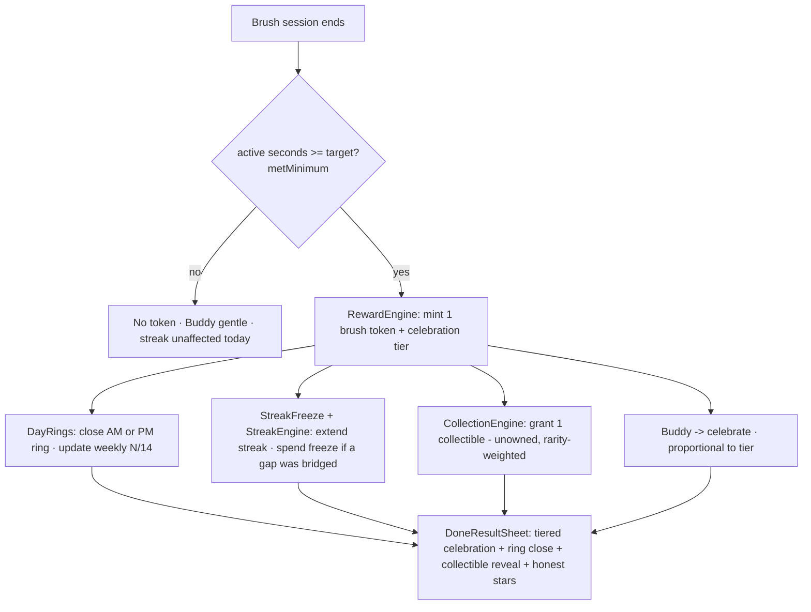
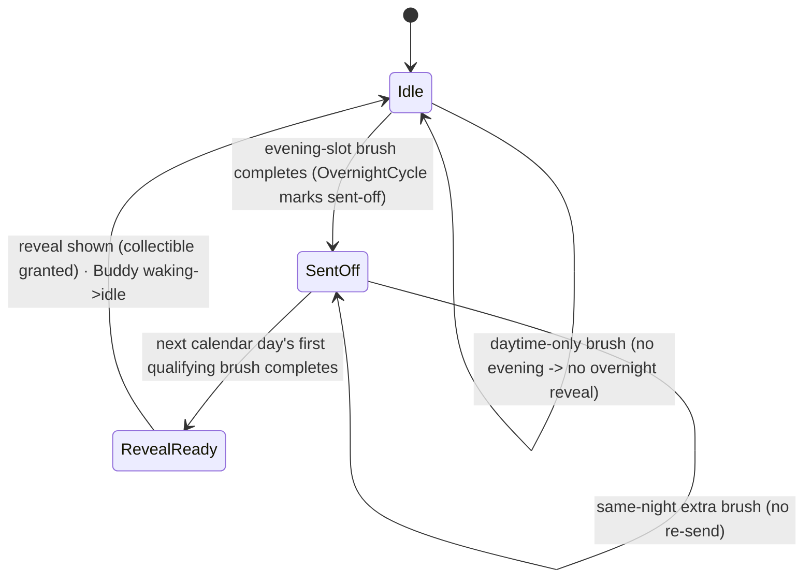

# feat: Kids-first retention engine (v1)

## Summary

Build ToothBuddy's kids-first retention loop: every **verifiable** 2-minute brush (timer ran full — never a quality judgement) mints a "brush token" that feeds a forgiving **two-ring/day streak + streak-freeze**, a **light variable-reward collection**, and **Buddy's emotional state**; an **overnight "morning reveal"** gives the two daily sessions distinct roles (evening sends Buddy off, morning he returns with a small surprise). The reactive Buddy prototype (`BuddyReactiveView.swift`) is wired into the real surfaces; the home + celebration screens are reworked around rings/Buddy/collection; notifications get Buddy's voice; camera zone-detection is demoted to optional guidance.

Research finding that shapes the whole plan: **much of the machinery already exists in `ToothBuddyCore`** — `StreakEngine` (already forgiving, already two-slot via `SessionSlot`), `ReminderPlanner` (already behavior-timed), and the honest `metMinimum`/`starCount` signals. This is an **extend-and-wire** plan, not a rebuild. There is **no "quality score" to delete** — it never existed (`starCount` is duration-only); R1 is information-hierarchy, not deletion.

---

## Problem Frame

ToothBuddy can't reliably measure brushing quality (camera zone-detection is guidance-grade, unproven on device). So retention can't come from "you brushed well." It must come from **protecting an accumulated thing** + **a character that needs you** — gated on the one signal we *can* verify: the timer ran full. This plan implements that loop for the kids-first v1 (adult mode is a restrained skin of the same core, per origin §3).

See origin for the full thesis, the 16-app research base, and the five non-negotiable design principles (P1–P5).

---

## Requirements Traceability

| Origin | Advanced by |
|---|---|
| **R1** Home rebuild (rings + Buddy + collection; no fake quality score) | U2, U6, U8 |
| **R2** Two-ring/day forgiving streak + streak-freeze | U1, U2, U3, U6 |
| **R3** Overnight loop + morning reveal | U4, U6, U9 |
| **R4** Buddy reacts (idle/brushing/celebrate/sad/waking) | U7 (asset already built: `BuddyReactiveView.swift`) |
| **R5** Light variable-reward collection | U5, U6, U11 |
| **R6** In-session trivia (kid-flavored) | U13 |
| **R7** Buddy-voice, behavior-timed notifications | U12 |
| **R8** Celebration rework (proportional; drop quality score) | U1, U10 |
| **R9** Camera demoted to optional guidance | U15 |
| **P1** Reward gates only on verifiable ritual completion | U1 (load-bearing), enforced across U2/U3/U5 |
| **P3** Buddy suffers but never dies | U7, U10 |
| **P4** Gentle, no shaming | U12 (copy), U9 (comeback) |

---

## Key Technical Decisions

**KTD1 — Reward gates on the honest timer signal only, never quality or count.** The "brush token" is minted off the existing `BrushingRecord.metMinimum` / active-seconds ≥ target (see origin: P1). New engines never read `cameraVerified` or coverage-as-quality. This is the product's existing honesty boundary (`ToothBuddyCore/Sources/ToothBuddyCore/BrushingRecord.swift`), not a new idea.

**KTD2 — Extend existing Core engines; add new pure types alongside.** Reuse `StreakEngine`, `SessionSlot`, `ReminderPlanner`, `metMinimum`, `starCount`. Net-new logic (`RewardEngine`, `DayRings`, `StreakFreeze`, `OvernightCycle`, `CollectionEngine`) lands as new files in `ToothBuddyCore/Sources/ToothBuddyCore/`, each `public`/`Sendable`/`Equatable`/deterministic with injected `now`/`calendar` and a matching test file (repo convention — mirrors `StreakEngineTests.swift`).

**KTD3 — Streak is re-promoted to a hero metric.** This intentionally **reverses U11**, which demoted streak to a "light consistency badge" (`GamificationStore.swift`). Origin R2 makes streak central to the kids-first loop; user confirmed. Widget/history/notification streak surfaces must stay consistent with the re-promoted model.

**KTD4 — All new persisted state is CloudKit-safe additive.** Per the load-bearing rule in `Persistence.swift` (every attribute optional-or-defaulted, every relationship has an inverse, no unique constraints — so the future `NSPersistentCloudKitContainer` mirror needs no migration). `CDCollectibleUnlock` mirrors `CDAchievementUnlock`; streak-freeze balance is a defaulted `CDProfile` attribute; device-local overnight flags live in `UserDefaults` (single-owner, intentionally *not* mirrored).

**KTD5 — Home is rebuilt in place in the Brush-tab idle hero — no new tab.** The Brush tab is already the default/center "home"; its idle hero already renders AM/PM pips (`BrushView.swift` `goalBar`). Reworking it is lower churn than a new tab (user confirmed). Reuse the Dynamic-Island top-pad workaround (see origin/[[safe-area-inset-gotcha]]) for the new top-anchored content.

**KTD6 — Buddy is hand-rigged SwiftUI (`BuddyReactiveView`), no Rive for v1.** R-1 is de-risked: the prototype exists, builds clean under Swift 6 strict / warnings-as-errors, and renders all 5 states. Rive remains an escape hatch (project is a real `.xcodeproj`, so it's addable without conversion) if hand-rig hits a ceiling — not needed for v1.

**KTD7 — kid/adult is a settings *skin*, not a mechanic fork.** Add a per-device intensity preference in `PreferencesStore`; do **not** revive `ProfileMode`/`CDProfile.mode` branching (smoke checklist A5 guards against a mode switch reappearing).

**KTD8 — Overnight boundary uses the device calendar + active-time.** "Reveal" gates on the same active-seconds notion `SessionClock` uses (not wall-clock). Edge rules (late-night-after-midnight, daytime-only, double-brush, skipped day, timezone) are defined and unit-tested in `OvernightCycle` (U4). Reconciled with the existing `StreakConfig.slotBoundaryHour = 12`.

---

## High-Level Technical Design

### Reward flow (per completed brush)



### Overnight cycle (why open twice)



### Layering (unchanged architecture)

- **Pure logic** → new files in `ToothBuddyCore/Sources/ToothBuddyCore/` (TDD, `swift test`).
- **App store layer** → a `@MainActor RetentionStore` reads records + persisted state, exposes rings/streak/tokens/collection/overnight to SwiftUI (thin side-effect wrapper — all math stays in Core).
- **UI** → `Duo.*` primitives + `BuddyReactiveView`; new app files added to `project.yml` sources.

---

## Output Structure (net-new files)

```
ToothBuddyCore/Sources/ToothBuddyCore/
  RewardEngine.swift          # token + celebration tier (U1)
  DayRings.swift              # two-ring/day + weekly progress (U2)
  StreakFreeze.swift          # consumable freeze + StreakEngine glue (U3)
  OvernightCycle.swift        # send-off / reveal-available + edge rules (U4)
  Collectible.swift           # content model + starter set (U5)
  CollectionEngine.swift      # unowned/rarity selection (U5)
Tests/ToothBuddyCoreTests/
  RewardEngineTests.swift · DayRingsTests.swift · StreakFreezeTests.swift
  OvernightCycleTests.swift · CollectionEngineTests.swift
(app root)
  RetentionStore.swift        # @MainActor surface for UI (U6)   [add to project.yml]
  MorningRevealView.swift     # reveal moment (U9)                [add to project.yml]
  CollectionView.swift        # browse the collectible book (U11) [add to project.yml]
```

Modified: `Persistence.swift`, `BrushingStore.swift`, `GamificationStore.swift`, `BrushView.swift`, `NotificationScheduler.swift`, `PreferencesStore.swift`, `SettingsView.swift`, `ContentView.swift`, `project.yml`, `Localizable.xcstrings`.

---

## Implementation Units

### Phase A — Core game logic (pure, TDD)

### U1. RewardEngine — brush-token + celebration tier
- **Goal:** Decide whether a completed session mints a brush token, and its celebration tier. The single gate the rest of the loop hangs on.
- **Requirements:** R2, R8, P1
- **Dependencies:** none
- **Files:** `ToothBuddyCore/Sources/ToothBuddyCore/RewardEngine.swift`, `ToothBuddyCore/Tests/ToothBuddyCoreTests/RewardEngineTests.swift`
- **Approach:** Pure enum with `evaluate(record:priorRecords:) -> RewardOutcome { mintsToken: Bool, tier: CelebrationTier }`. Token mints when `record.metMinimum` (reuse existing). `CelebrationTier`: `.belowMinimum`, `.metMinimum`, `.fullTwoMinutes`, `.personalRecord` (record vs prior best duration/streak). Never reads `cameraVerified` or coverage-as-quality.
- **Patterns to follow:** `StreakEngine.swift` (pure enum, injected inputs), `BrushingRecord.metMinimum`/`starCount`.
- **Test scenarios:**
  - Session with active ≥ target → mints token; tier `.metMinimum` at target, `.fullTwoMinutes` at ≥120s.
  - Session below target → no token, tier `.belowMinimum`.
  - Longest-ever duration/streak → `.personalRecord`.
  - `cameraVerified` true/false does not change the outcome (assert independence — Covers P1).
  - Empty `priorRecords` → no crash, no false record.
- **Verification:** `swift test` green for `RewardEngineTests`; no `cameraVerified` reference in the file.

### U2. DayRings — two-ring/day + weekly progress
- **Goal:** Compute today's AM/PM ring closure and the rolling weekly N/14 for the home surface.
- **Requirements:** R1, R2
- **Dependencies:** none (reads `SessionSlot`)
- **Files:** `ToothBuddyCore/Sources/ToothBuddyCore/DayRings.swift`, `ToothBuddyCore/Tests/ToothBuddyCoreTests/DayRingsTests.swift`
- **Approach:** Pure `DayRings.today(records:now:calendar:config:) -> DayRingState { amClosed, pmClosed, isPerfectDay }` and `weekProgress(records:now:calendar:) -> (closed: Int, of: Int)`. A slot ring closes when a qualifying (token-minting) session exists in that slot today. Reuse `SessionSlot`/`slotBoundaryHour`.
- **Patterns to follow:** `StreakEngine.evaluate` slot grouping; fixed-UTC-calendar test style.
- **Test scenarios:**
  - AM-only brush → amClosed, !pmClosed, !perfect.
  - Both slots → perfect day; weekly count increments correctly across a 14-slot window.
  - Boundary: a brush at 11:59 vs 12:01 lands in AM vs PM (Covers slot boundary).
  - No records → all open, weekProgress 0/14.
- **Verification:** `DayRingsTests` green.

### U3. StreakFreeze — consumable freeze + StreakEngine integration
- **Goal:** Turn the streak's implicit grace into an explicit, earned/spent "sick-day" freeze that saves a missed day, and re-promote streak to a hero metric.
- **Requirements:** R2
- **Dependencies:** U1
- **Files:** `ToothBuddyCore/Sources/ToothBuddyCore/StreakFreeze.swift`, `ToothBuddyCore/Tests/ToothBuddyCoreTests/StreakFreezeTests.swift`; modify `ToothBuddyCore/Sources/ToothBuddyCore/StreakEngine.swift` / `StreakConfig` (additive: keep existing behavior default).
- **Approach:** Pure `StreakFreeze.reconcile(records:priorBalance:now:calendar:config:) -> FreezeState { balance, spentToday, savedDays }`. Earn one freeze per consistency milestone (e.g., each perfect week, capped at 2). On a missed day with balance > 0, spend one to bridge instead of breaking. `StreakEngine` gains an optional freeze input so `frozenDays` reflects *spent* freezes (display "🛡 saved"). **KTD3 note in code comment:** re-promotes streak (reverses U11).
- **Execution note:** Implement the freeze rules test-first — the earn/spend/cap/break boundaries are the risk surface.
- **Patterns to follow:** `StreakEngine.frozenDays`, `StreakConfig` defaults.
- **Test scenarios:**
  - Earn cadence: balance rises one per completed perfect week, caps at 2.
  - Missed day with balance ≥ 1 → streak preserved, balance −1, day in `savedDays`.
  - Missed day with balance 0 → streak breaks per existing grace rule.
  - Two consecutive missed days with 1 freeze → one saved, then break.
  - Existing `StreakEngine` default behavior unchanged when no freeze passed (regression).
- **Verification:** `StreakFreezeTests` + existing `StreakEngineTests` green.

### U4. OvernightCycle — send-off / reveal-available
- **Goal:** Decide when Buddy is "out overnight" and when a morning reveal is available, with explicit timezone/edge rules.
- **Requirements:** R3
- **Dependencies:** U1
- **Files:** `ToothBuddyCore/Sources/ToothBuddyCore/OvernightCycle.swift`, `ToothBuddyCore/Tests/ToothBuddyCoreTests/OvernightCycleTests.swift`
- **Approach:** Pure `OvernightCycle.state(records:lastSendOff:lastReveal:now:calendar:) -> OvernightState { isSentOff, revealAvailable }`. Send-off arms when an evening-slot qualifying brush completes and no reveal is pending. Reveal arms when a *new calendar day's* first qualifying brush completes while sent-off. Edge rules (each a named test): after-midnight brush counts toward the new day; daytime-only usage (no evening) never arms a reveal; a second same-night brush does not re-send; a skipped day leaves state idle (no stale reveal). Uses device `calendar`; active-time gate per KTD8.
- **Execution note:** Test-first — the calendar boundary is where this breaks.
- **Test scenarios:**
  - Evening brush → isSentOff; next-morning brush → revealAvailable (Covers R3).
  - 00:30 brush after an evening send → counts as the new day's reveal, not same-night.
  - No evening brush, morning brush only → never revealAvailable.
  - Reveal consumed (lastReveal set) → not re-armed same day.
  - Skipped full day → idle, no stale reveal.
- **Verification:** `OvernightCycleTests` green.

### U5. CollectionEngine + Collectible content
- **Goal:** A finite-but-large collectible set and pure selection logic that grants one unowned item per reveal, rarity-weighted.
- **Requirements:** R5
- **Dependencies:** none
- **Files:** `ToothBuddyCore/Sources/ToothBuddyCore/Collectible.swift`, `ToothBuddyCore/Sources/ToothBuddyCore/CollectionEngine.swift`, `ToothBuddyCore/Tests/ToothBuddyCoreTests/CollectionEngineTests.swift`
- **Approach:** `Collectible { id, name, rarity }` + a static starter set (`Collectible.allCases`-style array; theme = "Buddy's friends/souvenirs", ~24 items across common/rare/legendary — final art/theme is an implementation content decision, deferred to art). `CollectionEngine.grant(owned:seed:) -> Collectible?` picks an unowned item weighted by rarity; deterministic via injected `seed` (index/counter, never `Date()`/`random()` internally — repo rule). Returns `nil` when all owned.
- **Patterns to follow:** `GamificationStore.allAchievements` static set; deterministic Core rule.
- **Test scenarios:**
  - Grant from empty owned → returns a valid unowned item.
  - Never returns an already-owned item.
  - Rarity weighting favors common over legendary across many seeds.
  - All owned → returns `nil` (no crash).
- **Verification:** `CollectionEngineTests` green.

---

### Phase B — Persistence & app store

### U6. Retention persistence + RetentionStore
- **Goal:** Persist the new owner state (collection unlocks, freeze balance, overnight flags) CloudKit-safely and expose the whole retention model to the UI through one `@MainActor` store.
- **Requirements:** R1, R2, R3, R5
- **Dependencies:** U1, U2, U3, U4, U5
- **Files:** modify `Persistence.swift` (new `CDCollectibleUnlock` entity mirroring `CDAchievementUnlock`; defaulted `freezeBalance` attr on `CDProfile`), new `RetentionStore.swift` (add to `project.yml` sources), modify `BrushingStore.swift` (call reward pipeline on `recordSession`), `Tests/ToothBuddyAppTests/RetentionStoreTests.swift`, `Tests/ToothBuddyAppTests/PersistenceTests.swift` (round-trip).
- **Approach:** `CDCollectibleUnlock(collectibleID, unlockedAt, profile inverse)` — copy the `CDAchievementUnlock` boilerplate (managed subclass + `toDTO()`/`apply()`, inverse relationship, no unique constraint). `freezeBalance: Int64 def 0` on `CDProfile`. Overnight `lastSendOff`/`lastReveal`/`pendingCollectibleID` in `UserDefaults` (device-local, not mirrored — like onboarding flags). `RetentionStore` (`@MainActor`, `ObservableObject`) recomputes rings/streak(with freeze)/tokens/collection/overnight from `BrushingStore.records` + persisted state on reload; grants a collectible + arms reveal when a qualifying session lands. Follow the `nonisolated(unsafe)` singleton justification pattern only if needed.
- **Patterns to follow:** `CDAchievementUnlock` + `GamificationStore.checkAndUnlock`; `BrushingStore.recomputeStreak`; `WidgetBridge` snapshot build.
- **Test scenarios:**
  - `CDCollectibleUnlock` round-trips (write → reload → present).
  - Pre-existing records with no freeze/collection state decode cleanly (backward-compat, Covers KTD4).
  - A qualifying session grants exactly one collectible and closes the right slot ring.
  - A below-target session grants nothing.
  - Freeze balance persists and reloads.
- **Verification:** `RetentionStoreTests` + `PersistenceTests` green; app builds; `bash scripts/audit.sh` 0 warnings.

---

### Phase C — Buddy & core surfaces

### U7. Wire BuddyReactiveView into BrushView (idle + active)
- **Goal:** Replace the static `BuddyView()` in the session flow with the reactive Buddy, driven by session state.
- **Requirements:** R4
- **Dependencies:** U6
- **Files:** modify `BrushView.swift` (idle hero ~line 377; active overlay), reference `BuddyReactiveView.swift`.
- **Approach:** Map session state → `BuddyMood`: idle hero → `.idle` (or `.sad` when a slot was missed today, via `RetentionStore`); during brushing → `.brushing`; on target reached → `.celebrate`. Keep static `BuddyView` for non-session decorative spots (header) for now. Respect `accessibilityReduceMotion` (BuddyReactiveView already gates continuous motion where relevant; verify).
- **Patterns to follow:** existing `BuddyView()` call sites; `PreferencesStore` gating.
- **Test scenarios:** `Test expectation: none — UI wiring.` Verified by build + the device smoke (mood transitions on start/stop). Add a small unit test only if a mood-mapping helper is extracted into Core.
- **Verification:** app builds; manual: Buddy shifts idle→brushing→celebrate across a session; sad when a slot is missed.

### U8. Home rebuild — rings + Buddy + collection entry
- **Goal:** Rebuild the Brush-tab idle hero around two rings + Buddy state + a collection entry; demote history stats below it. No fake quality score (none exists).
- **Requirements:** R1
- **Dependencies:** U2, U6, U7
- **Files:** modify `BrushView.swift` (idle hero / `goalBar` ~lines 516–543), possibly `ContentView.swift` (header), reuse `DuoComponents.swift`.
- **Approach:** Replace `DuoProgressPips(2)` with two proper AM/PM rings (a `RingView` built from `Duo.*`; SwiftUI `Circle().trim` + chunky outline) bound to `DayRings`. Add Buddy (from U7) as the hero, a streak flame chip, and a "collection" entry (progress + tap → `CollectionView`). Reuse the Dynamic-Island top-pad workaround (KTD5). Keep `HistoryView` content but ensure the home hierarchy leads with Buddy/rings.
- **Patterns to follow:** `goalBar`, `DuoProgressPips`, `HistoryView.streakCard`, safe-area workaround in `ContentView.swift`.
- **Test scenarios:** `Test expectation: none — presentational.` Verified by build + smoke; any ring-fraction math lives in `DayRings` (U2, tested).
- **Verification:** home shows two rings reflecting today's brushes, Buddy state, streak, collection entry; no horizontal clipping under the Dynamic Island.

### U9. MorningReveal — the "魔法一下"
- **Goal:** When a reveal is available, present Buddy returning with a collectible.
- **Requirements:** R3, R5
- **Dependencies:** U4, U5, U6
- **Files:** new `MorningRevealView.swift` (add to `project.yml`), modify `BrushView.swift`/`ContentView.swift` to present it when `RetentionStore.overnight.revealAvailable`.
- **Approach:** A sheet/overlay: `BuddyReactiveView(mood: .waking)` → hands over the granted collectible (from `pendingCollectibleID`) with a small line of copy; dismiss marks `lastReveal` consumed. Gated on the morning brush completing (U4), never on app-open (P1). Respect reduce-motion.
- **Patterns to follow:** `DoneResultSheet` sheet presentation; `DuoCard`.
- **Test scenarios:** reveal-arming logic is in `OvernightCycle` (U4, tested). `Test expectation: none — presentational` for the view itself; add a `RetentionStore` test that consuming a reveal clears `revealAvailable`.
- **Verification:** evening brush then next-morning brush surfaces exactly one reveal; re-opening the app without a new brush does not.

### U10. Celebration rework — proportional tiers
- **Goal:** Rework `DoneResultSheet` into proportional celebration (min-line / full-2min / record) with reactive Buddy, ring closure, and collectible reveal; keep honest stars + verification badge.
- **Requirements:** R8, P3
- **Dependencies:** U1, U6, U7
- **Files:** modify `BrushView.swift` (`DoneResultSheet` ~line 823), `BrushGameOverlay.swift` (`winCelebration` ~line 378).
- **Approach:** Extend the current 2-way `metMinimum` branch into `CelebrationTier` (from U1): confetti volume / Buddy action / sound scale with tier. Swap `FoamView` → `BuddyReactiveView(mood: .celebrate)`. Add ring-close animation + collectible reveal hand-off. Keep `StarRatingView` (duration-honest) + `cameraVerified` badge. Remove nothing quality-score-like (none exists).
- **Patterns to follow:** existing `DoneResultSheet` branch, `StarRatingView`/`BounceButtonStyle` (`Theme.swift`), `BrushGameOverlay` confetti.
- **Test scenarios:** tier selection is in `RewardEngine` (U1, tested). `Test expectation: none — presentational` for the sheet.
- **Verification:** below-min / met / full-2min / record each show visibly different celebration intensity; Buddy celebrates; a collectible reveals on a qualifying session.

### U11. CollectionView — the collectible book
- **Goal:** A screen to browse unlocked vs locked collectibles.
- **Requirements:** R5
- **Dependencies:** U5, U6
- **Files:** new `CollectionView.swift` (add to `project.yml`), entry point from U8's home collection tile.
- **Approach:** Grid of collectibles (owned = full art, locked = silhouette + "?"), progress header (owned/total), rarity styling. Reuse `Duo.*` cards. No spend/economy UI (v1 grants are automatic).
- **Patterns to follow:** `HistoryView.achievementsRow`, `DuoCard`/`DuoBadge`.
- **Test scenarios:** `Test expectation: none — presentational` (data from `CollectionEngine`/`RetentionStore`, tested in U5/U6).
- **Verification:** owned items render distinctly from locked; progress matches unlock count.

---

### Phase D — Retention support layers

### U12. Buddy-voice + reveal notifications
- **Goal:** Rewrite reminder copy into Buddy's voice and add a morning "come see what Buddy brought back" reveal reminder. Behavior-timed scheduling already exists.
- **Requirements:** R7, P4
- **Dependencies:** U4
- **Files:** modify `NotificationScheduler.swift` (copy in `title(for:)`/`body(for:)` ~lines 100–118), `ToothBuddyCore/Sources/ToothBuddyCore/ReminderPlanner.swift` (+ new `ReminderKind` case for reveal-teaser + planner branch), `Localizable.xcstrings`, `ToothBuddyCore/Tests/ToothBuddyCoreTests/ReminderPlannerTests.swift`.
- **Approach:** Copy swap → Buddy voice (routed through `String(localized:)`), keeping the gentle, no-shame P4 tone and the contextual no-re-prompt auth. Add `ReminderKind.revealTeaser` scheduled for the morning slot when a reveal is pending; keep the existing collision handling. All timing math stays in `ReminderPlanner` (Core).
- **Patterns to follow:** `ReminderPlanner.adaptiveTime`, existing `ReminderKind` split, `String(localized:)` convention.
- **Test scenarios:**
  - Reveal-teaser only schedules when overnight state is sent-off/pending (Covers R3↔R7 link).
  - Reveal-teaser collision with morning routine is de-duplicated.
  - Existing morning/evening/streak-at-risk timing unchanged (regression).
- **Verification:** `ReminderPlannerTests` green; copy reads in Buddy's voice; no re-prompt for permission.

### U13. In-session trivia — kid tone
- **Goal:** Give the already-visible in-session tips a kid-flavored voice, gated by the intensity preference.
- **Requirements:** R6
- **Dependencies:** U14 (reads the preference)
- **Files:** modify `BrushView.swift` (`brushTips` ~lines 151–257, `rotatingTipSection` ~line 271).
- **Approach:** The tip carousel already renders during active brushing (confirmed). Add kid-voiced variants (or a playful subset) selected when intensity = kid; keep the existing set for adult/essentials. Low-cost — no new pipeline. (Moving the 100 facts into the Core `ContentEngine` is **deferred** tech-debt, see Scope Boundaries.)
- **Patterns to follow:** existing `rotatingTipSection`, `ContentTone` (`PreferencesStore`).
- **Test scenarios:** `Test expectation: none — content/presentational` (selection is a simple preference read; add a tiny helper test only if extracted).
- **Verification:** kid mode shows playful tips during brushing; adult mode shows the essentials tone.

### U14. Kid/adult intensity preference (skin, not fork)
- **Goal:** A per-device preference that tunes Buddy liveliness / celebration intensity / trivia tone — one core, two skins.
- **Requirements:** origin §3 (kid-first with adult skin)
- **Dependencies:** none
- **Files:** modify `PreferencesStore.swift` (new `intensity`/reuse `contentTone`), `SettingsView.swift` (a `Picker`), seed from `OnboardingPreset` (Core). **Do not** touch `ProfileMode`/`CDProfile.mode`.
- **Approach:** Add a `PreferenceDefaults`-seeded per-device value read at Buddy/celebration/collection/trivia surfaces. Kid = livelier Buddy, bigger celebrations, playful trivia; adult = restrained. Seed default from the onboarding "who's this for" preset.
- **Patterns to follow:** existing `PreferencesStore` booleans + `apply(PreferenceDefaults)`, `SettingsView` sections.
- **Test scenarios:** `Test expectation: none — settings plumbing`; if a Core mapping helper is added, test its defaults.
- **Verification:** toggling the preference visibly changes Buddy/celebration intensity; no kid/adult *mode* switch exists (smoke A5 preserved).

### U15. Camera demotion to optional guidance
- **Goal:** Reposition the smart-mirror as opt-in guidance (not the session hero); guarantee the reward/streak/collection engines never gate on `cameraVerified`; keep the record schema + dentist proof intact.
- **Requirements:** R9
- **Dependencies:** U1, U6
- **Files:** modify `BrushView.swift` (session layout / mirror prominence), `SettingsView.swift` (mirror as clearly optional). No `Persistence.swift` schema change.
- **Approach:** Make audio-first the default framing and the mirror an optional aid (session already supports `useCamera=false`). Assert in code/tests that `RewardEngine`/`DayRings`/`StreakFreeze`/`CollectionEngine` inputs exclude `cameraVerified`. Keep `cameraVerified` column, `DoneResultSheet` badge, and `ReportBuilder` dentist PDF usage.
- **Patterns to follow:** `SessionModeResolver`, `BrushingZoneMonitor` (`useCamera` gate), existing `cameraVerified` surfaces.
- **Test scenarios:** covered by U1's independence test; add a `RetentionStore` test that an audio-only (unverified) qualifying session still mints a token and closes a ring (Covers R9↔P1).
- **Verification:** audio-only sessions earn full rewards; dentist PDF still shows verification when the mirror was used.

---

## Scope Boundaries

### Deferred for later (origin — post-v1)
- Full overnight **adventure content** (maps, multi-beat stories) and Buddy **world-building / deep customization**.
- **Networked sharing**: remote parent "kid brushed" ping, friend/sibling brush-streak, dentist online record link (needs accounts/backend — origin Phase 2).
- Adult-mode **independent mechanisms** (v1 is a restrained skin only).

### Outside this product's identity (origin)
- Clinical/quality scoring, plaque detection, technique grading.
- Competitive leaderboards / ranked peer comparison.
- Real-money gacha, loot boxes, pay-to-save-streak, token economies.
- Buddy permadeath / permanent punishment.

### Deferred to Follow-Up Work (plan-local)
- Moving the 100 hardcoded `brushTips` into the Core `ContentEngine`/`ContentSelector` pipeline (on-convention tech-debt; PROGRESS already flags it). U13 does the low-cost tone pass instead.
- `ProfileMode` / `CDProfile.mode` dead-column cleanup (zero-risk, non-blocking).
- `SettingsView` visual restyle to `Duo.*` (design polish, separate from retention).
- Localizing the (now kid-toned) `brushTips` strings.

---

## Risks & Dependencies

- **Real-device verification is the standing gate.** The whole product has never run on hardware. R4 animation fluidity, R3 reveal timing, and the "will a kid actually open it" thesis need device validation. This plan is written to be device-validated after Phase C lands (run `docs/phase-1-5-device-smoke-checklist.md` + a new Buddy/reveal pass). R-1 itself is de-risked (prototype builds + renders).
- **Overnight boundary edge cases** — mitigated by `OvernightCycle` unit tests (U4); still confirm on device across a real night + timezone.
- **Audio-session interruption gap (checklist D2, still open)** — a foreground silent-gap interruption may not pause the timer, which slightly affects the "timer ran full" gate on device. Pre-existing; note, don't fix here.
- **Streak re-promotion (KTD3)** reverses U11 — keep widget (`WidgetSnapshot`), `HistoryView`, and notifications consistent with the promoted model, or the surfaces will disagree.
- **project.yml drift** — every new app file (`RetentionStore`, `MorningRevealView`, `CollectionView`) must be added to `project.yml` sources + `xcodegen generate`, or it won't compile in.

## System-Wide Impact

- **Widget** (`WidgetSnapshot`/`StreakWidget`): rings + re-promoted streak should flow through `WidgetBridge`; update the snapshot to match the new home.
- **Siri** (`quickLogForCurrentSlot`), **Live Activity**, **HealthKit**: unaffected by the reward loop; verify a Siri-logged session still mints a token via `RetentionStore`.
- **Dentist PDF** (`ReportBuilder`): `cameraVerified` retained (R9) — unchanged.
- **Never touch** `MetricsSubscriber` (documented crash-safety rule).

## Verification

- Core: `cd ToothBuddyCore && swift test` (new engine tests + existing 142 green).
- Full: `bash scripts/audit.sh` (Core `swift test` + app `xcodebuild test`, **0-warning** red line; baseline Core 142 + app 54).
- Device: wire-up + reveal + animation fluidity on a real iPhone (the standing gate).

## Sources & Research

- Origin requirements: `docs/brainstorms/2026-07-03-toothbuddy-retention-engine-requirements.md`
- Design research + Buddy R-1 result: `docs/design-research/` (`ui-ux-benchmark-2026-07.html`, `mockups.html`, `buddy-states.png`), prototype `BuddyReactiveView.swift`
- Existing Core engines reused: `ToothBuddyCore/Sources/ToothBuddyCore/StreakEngine.swift`, `SessionSlot.swift`, `ReminderPlanner.swift`, `BrushingRecord.swift`
- Conventions/decisions: `PLAN.md` (decision log, Core-TDD + project.yml rules), `docs/PROGRESS.md`, `docs/phase-1-5-device-smoke-checklist.md`
