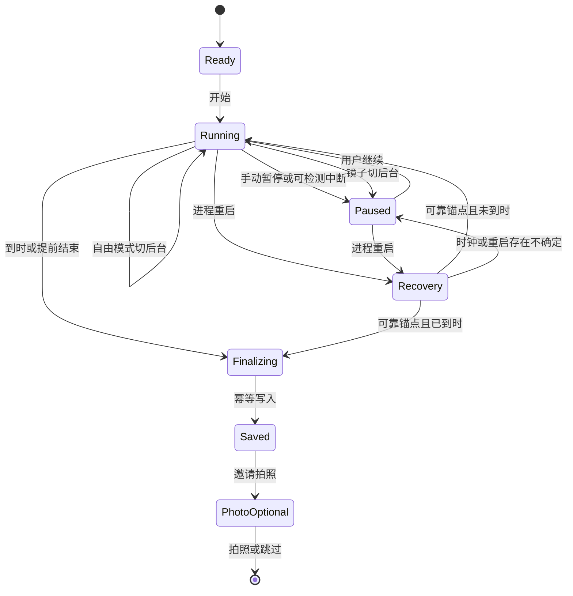
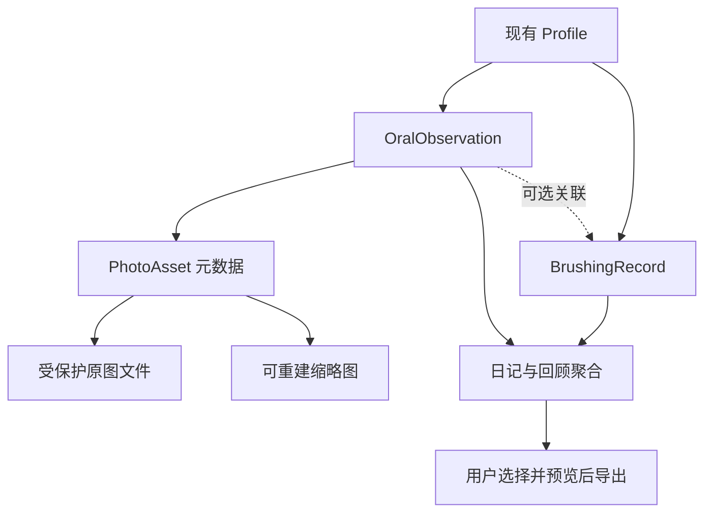

# ToothBuddy Oral Care Journal - Plan

## Goal Capsule

- **Objective:** 成人和儿童都能完成日常刷牙、留下照片与口腔情况记录，并在一周或一个月后回顾自己的护理过程。
- **Means:** 在现有 iOS App 上实现三种刷牙模式、口腔照片日记、周月回顾及两种体验预设，复用现有记录与 Buddy 能力（KTD1–KTD8）。
- **Authority:** 本计划承接 2026-09-05 用户认可的方案；遇到方向冲突，以本计划 Product Contract 优先于旧 north-star、留存需求和 feature inventory。旧文档作为历史依据，不作为新增多档案或临床诊断的授权。
- **Target:** ToothBuddy.swiftpm 完整 Git 仓库，remote 为 CTlandu/ToothBuddy，核查基线 701687b。不是 brushes 下同名的早期副本。
- **Execution:** 本文件只规划。后续实施按 U-ID 依赖顺序完成，并保留已有刷牙记录和收藏。
- **Stop conditions:** 数据迁移出现丢失、后台行为不符合平台能力、或实现需要扩大到多账号/服务器时，暂停对应单元并报告证据。真机验证未通过不得宣称版本完成。
- **Delivery:** 默认交付可审查代码、测试结果、真实模拟器截图及真机检查记录。发布 App Store、上传用户照片、推送远程分支不属于本计划的执行授权。

---

## Product Contract

### Summary

将 ToothBuddy 从刷牙计时与奖励工具升级为日常口腔护理记录 App。导航改为“今天 / 日记 / 回顾”，刷牙后可拍照，成人与儿童共用记录能力并采用不同的呈现重点。

### Problem Frame

现有项目已具备计时、语音、相机引导、提醒、Core Data 记录、Buddy、收藏及 Apple 集成，但缺少口腔照片的采集、存储和比较。当前切后台会暂停计时，难以支持一边刷牙一边使用其他 App。现有记录以分区达标为中心，不能直接用于自由计时，否则会把没有分区数据的有效计时误判为未完成。

用户希望通过记录与回顾获得长期价值。照片是否会出现肉眼可见的改善尚未验证，因此成就感同时来自护理坚持和记录积累，不依赖“变白”或健康评分。

### Key Decisions

- **记录优先，保留角色陪伴。** (session-settled: user-directed — chosen over collection-led positioning: the user wants a lasting oral-care record.) Governs R1, R5, R8, R10.
- **一个 App 内两种体验，共享能力。** (session-settled: user-approved — chosen over separate adult and child apps: avoid duplicate functionality and maintenance.) Governs R2, R10.
- **照片可跳过，刷牙先保存。** (session-settled: user-approved — chosen over mandatory photo check-in: photography must not block the daily record.) Governs R4, R5.
- **提供变化记录，不做照片诊断。** (session-settled: user-approved — chosen over automatic health scores: the available evidence does not support clinical conclusions.) Governs R7, R8.

### Requirements

**入口与体验**

- R1. 主导航为“今天 / 日记 / 回顾”；今天页提供一个主要的开始入口，并显示今日早晚记录、最近照片与回顾入口。
- R2. 成人/儿童是可切换的体验预设，不代表不同身份；切换不会创建、切换或清空记录，也不会封锁照片、回顾或卡通功能。
- R3. 刷牙支持陪伴、自由计时、镜子三种模式；用户在开始前选择，过程中提供暂停、继续和提前结束。
- R4. 正常到时保存记录并进入完成页，拍照是后续可选动作；后台到时在下次可执行时幂等落库，记录结束时间按目标截止时间计算。

**照片与回顾**

- R5. 可从完成页或日记独立拍照；照片和刷牙记录可关联但各自独立存在，跳过/失败不影响刷牙保存。
- R6. 支持拍摄位置引导、上一张参考、预览、重拍、日期与视角标识；保留原图，不做美白、美颜或自动颜色归一化。
- R7. 允许为照片或独立观察记录添加备注和可选自述标签；不得把自述、计时或相机检测写成医学诊断。
- R8. 提供日记时间线、双日期照片比较和周/月回顾；少于两张照片时显示明确空态，不生成虚假趋势或健康改善结论。
- R9. 用户可删除单张照片或独立观察记录；删除刷牙记录只解除照片关联，删除照片不扣除刷牙完成状态或奖励。

**习惯、保护与兼容**

- R10. 保留 Buddy、适度庆祝和现有收藏；新奖励依据完成设定计时的护理仪式，不奖励拍照次数、牙齿颜色或超时刷牙，手动补记不铸新奖励。
- R11. 提供早晚提醒和照片提醒频率设置；允许关闭，通知拒绝不阻止使用。
- R12. 照片默认保存在 App 私有空间，不自动存入系统相册、不上传；导出前由用户选择日期及照片并预览。
- R13. 升级保留旧记录、收藏及偏好；旧记录来源无法确定时显示“历史记录”，不追溯标成新模式已验证。
- R14. Widget、Live Activity、Siri 和 HealthKit 对完成状态的解释与 App 一致；锁屏界面不展示牙齿照片或症状备注。
- R15. 核心页面支持现有中英文、动态字号、VoiceOver 和减少动态效果；新增功能必须有真实构建运行证据。

### App Changes

下表是用户能直接看到的页面改造清单；实现依赖见 Implementation Units。

| 页面 | 当前情况 | 目标内容与交互 | 交付 |
|---|---|---|---|
| 首次引导 | 七页，以相机/成就介绍为主 | 三步：认识用途、选择体验与默认模式、开始；权限在实际使用时请求 | M1 基础，M2 双体验 |
| 今天 | Brush 页面承载入口、相机与指标 | 早晚状态、Buddy、主要开始按钮、最近照片；成人重记录，儿童重陪伴 | M1 |
| 刷牙中 | 前台计时，切后台暂停 | 模式说明、剩余时间、暂停/继续、提前结束；语音和趣味内容可分别关闭 | M1 |
| 完成页 | 时长/覆盖/验证/星星/收藏/删除混合 | 已保存状态、简短反馈、拍照与跳过；详情折叠，删除移至日记 | M1 |
| 拍照页 | 无 | 位置轮廓、上次参考、快门、预览重拍；失败可重试且记录不丢 | M1 |
| 日记列表 | History 以记录和成就为主 | 按日期组合刷牙、照片、自述；筛选全部/照片/刷牙；独立添加入口 | M1 |
| 日记详情 | 记录管理为主 | 大图、日期、来源、关联 session、备注、删除；无图也可阅读 | M1，M3 完善备注 |
| 照片对比 | 无 | 选两个日期、并排与滑动对比、同步缩放；光照/角度不同提示 | M1 基础，M3 辅助 |
| 回顾 | 历史统计与 PDF | 周/月切换、早晚记录概况、时长、照片入口、观察摘要；无数据解释 | M1 基础，M2/M3 完善 |
| Settings | 功能开关 | 体验预设、模式、时长、内容/语音/动画、照片频率、隐私与存储、导出 | 各阶段同步 |
| 收藏 | 独立弹层，图形占位 | 保留数据和入口，放入 Buddy 区域；本轮不扩地图或新货币 | M2 |
| Tips | 独立主 tab | 原内容进入刷牙内容选择或辅助阅读入口，不丢内容 | M1/M2 |

### Visual Direction

保留现有卡通语言与 BuddyReactiveView。成人默认较低动画强度、较少描边容器，以记录与照片为视觉重点；儿童默认突出 Buddy、早晚状态和短庆祝。对比页使用中性背景，避免装饰色影响照片观察。两套体验使用同一组件库，不复制两套页面逻辑。

先修共享 DuoButton 的扩张阴影和安全区问题，再组织页面。主要按钮位于易触及位置且尺寸由标签决定；小屏和大字号允许滚动，不能压掉拍照/跳过按钮。早安问候并入今天页，不再用只关闭弹层的“开始刷牙”按钮。

### Key Flows

- F1. 日常刷牙：今天 → 选模式 → 运行/暂停 → 保存 → 可选拍照 → 日记。Covers R1, R3–R6.
- F2. 切走使用其他 App：开始自由计时 → 切后台 → 系统倒计时显示/可选通知 → 返回恢复 → 到时记录 → 可选拍照。Covers R3, R4, R14.
- F3. 独立观察：日记添加 → 拍照或自述 → 保存 → 查看/删除。Covers R5, R7, R9.
- F4. 回顾：选择周/月 → 查看已记录情况 → 选择两张照片 → 比较 → 选择导出内容并预览。Covers R8, R12.

### Acceptance Examples

- AE1. 自由计时 120 秒，30 秒后切后台，三分钟后回来：只保存一次 120 秒计时记录，覆盖为空，不显示相机验证。Covers R3, R4, R7.
- AE2. 刷牙结束后拒绝相机权限：刷牙记录和完成状态仍在，出现可跳过的解释，无黑屏。Covers R4, R5, R11.
- AE3. 保存照片时磁盘不足：保持刷牙记录，明确照片未保存，可重试，不显示虚假的照片缩略图。Covers R5, R6.
- AE4. 切换儿童体验：原有照片、记录和收藏保持，允许重新调整动画强度。Covers R2, R13.
- AE5. 删除一条关联刷牙记录：照片仍可在日记查看；删除照片后刷牙状态不变。Covers R9.
- AE6. 只有一张照片：展示首张记录并邀请以后比较，不绘制变化曲线。Covers R8.
- AE7. 系统重启/时钟异常后恢复：不按过期墙钟自动补满，展示待确认的中断记录，不自动发奖励。Covers R4, R7, R13.

### Scope Boundaries

本轮覆盖三个里程碑 M1–M3。M1 是可试用版本，不代表全部计划完成。

延后：远程家庭管理、多档案切换、账号与云同步、在线牙医链接、AI 照片分析、自动跨角度配准、复杂世界地图、大规模新角色资产、商业化与上架工作。

本版不提供：临床诊断、健康/美白分数、后台相机持续监控、照片强制打卡。系统相册导入也延后；第一版先验证 App 内拍摄的一致性。

### Assumptions To Validate

- 照片主动邀请默认每日一次，可选每次/每周/关闭；这是可配置产品假设，不是已经验证的最佳频率。
- 默认先采集正面一张；其他视角可选。不要求用户购买配件或使用口腔拉钩。
- 首次未选预设时采用成人、自由计时、低动画强度；儿童预设默认陪伴。已有安装保留其设置，不能强制重置。
- 一人一套本地数据；家长协助孩子操作不等于本轮支持多个人混用档案。
- 小规模一至两周试用验证拍照负担和回顾价值；留存目标尚无基线，不设虚构的提升百分比。

---

## Planning Contract

### Current Implementation

基于 2026-09-05 只读核查：SwiftUI，iOS 17 起，XcodeGen 的 project.yml 显式列出源文件。Core 为独立 Swift Package，App 使用可注入测试存储的 Core Data/ObservableObject 模式。

BrushView 同时管理 UI、计时、语音、相机和弹层。SessionClock 累积活跃片段；BrushingStore 在启动时恢复旧快照。BrushingRecord.metMinimum 依赖时长与分区覆盖，RewardEngine/RetentionStore 使用它；自由计时不能伪造 coverage 来获得奖励。

CameraService 是单一 AVCaptureSession 所有者，已有视频输出但没有照片输出。PreferencesStore 当前只有 audio/mirror，默认 mirror。BrushingLiveActivity 接收 secondsRemaining，且启动时清掉旧 activity，需要跟恢复逻辑一起改。

旧 docs/PROGRESS.md 更新晚于 5 月重做、早于 7 月留存提交，不能将里面的测试数量当成当前验收结果。未发现 docs/solutions 或 CE 配置；不新增平行的第二套产品权威文档。

### Key Technical Decisions

- KTD1. **从 View 提升 session 所有权。** 新增应用级 BrushingSessionCoordinator，集中处理计时状态、快照、完成和通知；BrushView 只绑定状态。沿用 Core 纯逻辑 + App 集成层，避免 tab 切换销毁计时。Supports R3, R4, R14.
- KTD2. **后台依赖时间锚点，不依赖 Timer 保活。** 自由计时使用持久化 session ID、目标、已累计时间、暂停状态、单调时间锚点与墙钟截止时间；UI 的每秒 tick 仅渲染。正常同次设备启动期间可恢复，系统重启或时钟矛盾走 AE7。到时上限为目标时长。Supports R3, R4.
- KTD3. **陪伴与镜子不伪造后台检测。** 陪伴播放真实内容时使用合法后台音频能力；禁止静音保活。自由计时可完全无声。镜子切后台关闭相机并暂停，回到前台明确继续；开始前说明需前台使用。音频被来电/闹钟中断时暂停并等用户恢复；自由模式未被系统告知的中断不能声称已检测。Supports R3, R7.
- KTD4. **完成判定与证据分开。** 新增 mode/source/completion 语义与仪式完成策略；保留旧 metMinimum 的历史含义。目标计时完成可关闭对应环，最多沿用现有早晚两次奖励额度，补记仅作为自述。coverage、cameraVerified 保留原始数据，UI 单独解释，不因拍照而升级证据。Supports R7, R10, R13, R14.
- KTD5. **独立观察实体与受保护文件。** OralObservation 属于 profile，可选关联 session，拥有零或多张 PhotoAsset 与自述字段。Core Data 存元数据，原图在 Application Support，缩略图可重建。删除 session 使用解除关联。Supports R5–R9, R12.
- KTD6. **文件和数据库采用可恢复提交。** 原图写入受保护 staging，再移入最终 UUID 路径，最后事务保存元数据；失败补偿和重启 orphan 清理只处理明确未被引用且没有在途保存任务的本模块文件。保存、删除与回收经同一串行所有者协调，禁止回收正在提交的文件。照片读取失败显示不可用，不连带删除文本。Supports R5, R9, R12.
- KTD7. **扩展现有单相机服务。** 在其串行队列配置 photo output，照片拍摄与镜子检测互斥，切换完成后才进入下一用途；视角、旋转和镜像统一，参考图与新图可比较。Supports R3, R6.
- KTD8. **共享布局与可覆盖预设。** 新预设只播种用户偏好，切换明确提示将改变哪些偏好，手动修改继续有效；App 按偏好决定显示强度，不按年龄到处复制业务分支。Supports R2, R10, R15.
- KTD9. **元数据与资源迁移先于 UI 切换。** 给程序化 Core Data 模型保留旧版本定义及迁移入口，以旧 store fixture 验证迁移；不能假定新增 optional 字段即可找回已丢失的旧模型。任何迁移失败保留原库，禁止清库重建。Supports R13.
- KTD10. **私有存储不等于自动云备份。** 原图采用受保护私有目录并保留正常系统备份资格，缩略图/导出临时文件不作永久副本；界面说明无 App 自有云同步，系统备份依赖设备设置且本 App 不验证其完成。分享副本去掉非必要定位/设备元数据；删除无法撤回用户已分享副本。Supports R12.

### Timer State Design

音频能否持续播放、通知是否响铃与记录计算是独立能力。App 挂起时不承诺执行写库回调；重新运行才 reconcile。通知被关闭时仍可计时，明确显示“到时提醒未开启”。陪伴恢复时只念当前提示，不补播所有错过内容。

### Data Design

照片保存路径按 KTD6 提交；列表只读缩略图，比较时最多解码选中两张。观察记录保留拍摄时间、时区、视角、来源和可选备注。日记按事件当时的本地日期归档；统计按照每条记录捕获的本地日期/早晚 slot 聚合，跨午夜 session 归开始日。旧记录缺少时区时标注历史推算，不反复随当前时区移动。周回顾采用用户日历周定义。

### Delivery Sequence

- **M1 / 可试用闭环：** U1–U7。包含三模式基础、刷后照片、独立拍照、日记、基础比较、基础周月回顾和隐私底线。成人/儿童先使用共享界面加已有内容预设。此时必须完成 U11 中适用的构建/迁移/真机检查；新模式未经 U9 验证的系统导出入口保持不可用并说明原因，旧记录仍可查看。
- **M2 / 双体验与坚持：** U8–U9。完善两种首页、内容、提醒、Buddy 与系统入口一致性。
- **M3 / 回顾与交付：** U10–U11。完善观察记录、拍摄质量提示、报告、全量验证和产品文档。

不估算日历工期；后台音频和拍摄真机验证先做技术风险检查，再确认排期。M1 不能以“后台 timer 代码能编译”替代 AE1 的真实设备证据。

---

## Implementation Units

| Unit | 内容 | 主要文件 | 依赖 |
|---|---|---|---|
| U1 | 数据与迁移 | Persistence.swift、BrushingStore.swift | 无 |
| U2 | 后台计时 | BrushingSessionCoordinator.swift | U1 |
| U3 | 模式与音频 | BrushView.swift、VoiceCoach.swift | U2 |
| U4 | 导航与今天页 | ContentView.swift、TodayView.swift | U2 |
| U5 | 照片存储 | PhotoAssetStore.swift | U1 |
| U6 | 拍照与完成页 | OralPhotoCaptureView.swift | U3、U4、U5 |
| U7 | 日记与比较 | JournalView.swift、PhotoComparisonView.swift | U4、U5、U6 |
| U8 | 双体验 | PreferencesStore.swift、TodayView.swift | U7 |
| U9 | 提醒与系统集成 | NotificationScheduler.swift、HealthExporter.swift | U2、U8 |
| U10 | 观察与导出 | ReviewView.swift、ReportPDFRenderer.swift | U7、U9 |
| U11 | 整体验证 | project.yml、文档和测试 | U1–U10 |

### U1. Record Semantics And Migration

**Goal:** 为新记录和独立观察建立兼容的数据基础。**Requirements:** R4, R7, R9, R10, R13。**Dependencies:** 无。

**Files:** 修改 Persistence.swift、ToothBuddyCore/Sources/ToothBuddyCore/BrushingRecord.swift、BrushingStore.swift、RetentionStore.swift、ToothBuddyCore/Sources/ToothBuddyCore/RewardEngine.swift；新增 ToothBuddyCore/Sources/ToothBuddyCore/OralObservation.swift、ToothBuddyCore/Sources/ToothBuddyCore/SessionCompletionPolicy.swift、Tests/ToothBuddyAppTests/RecordMigrationTests.swift；扩展 Tests/ToothBuddyAppTests/PersistenceTests.swift、RetentionStoreTests.swift 和 Core 的 BrushingRecordTests.swift。

**Approach:** 按 KTD4、KTD5、KTD9 增加字段与实体，固定旧模型版本，独立计算计时完成。记录、早晚环和奖励消费者在此单元一起接入新策略，避免 M1 仍按旧分区规则判定；U8 负责呈现与整体验证。参考当前注入式 store 测试。后续每个新增 App 文件同步加入 project.yml。

**Test scenarios:**

- 旧数据库迁移后 ID、日期、覆盖、收藏与偏好不丢失。
- 自由计时完成且 coverage 为空仍为仪式完成，不能标作相机验证。
- 同一个 session ID 两次提交只产生一条记录。
- 迁移失败不删除原 store；删除 session 不级联删除观察。

**Verification:** fixture 迁移及新旧记录混合读取测试通过。

### U2. Session Coordinator And Background Timing

**Goal:** session 脱离页面生命周期，自由计时支持切走和锁屏。**Requirements:** R3, R4, R14；F2/AE1/AE7。**Dependencies:** U1。

**Files:** 新增 BrushingSessionCoordinator.swift、ToothBuddyCore/Sources/ToothBuddyCore/SessionRecoveryPolicy.swift；修改 BrushView.swift、MyApp.swift、SessionClock.swift 与 InProgressSessionSnapshot.swift（Core）、BrushingLiveActivity.swift、Shared/BrushingActivityAttributes.swift、Widget/BrushingLiveActivityWidget.swift；测试 Tests/ToothBuddyAppTests/BrushingSessionCoordinatorTests.swift、Core 的 SessionClockTests.swift、SessionRecoveryPolicyTests.swift。

**Approach:** KTD1–KTD3；先保留已有活跃计时测试，再增加模式矩阵。Live Activity 使用时间区间渲染而非依赖每秒 push，暂停固定剩余值；本地通知负责可选到时提醒，不能用于保活。

**Test scenarios:**

- Covers AE1：进程挂起后恢复，时长封顶且幂等。
- 暂停期间锁屏再返回，不补计暂停时间，通知截止时间随恢复更新。
- Covers AE7：重启或改系统时间后进入明确恢复状态。
- 页面/tab 切换、重复 Siri 开始不创建第二场。
- 结束后不重现旧 Live Activity；通知拒绝不影响保存。

**Verification:** Core 状态测试、App 恢复集成测试及真机锁屏/切 App 验证。

### U3. Brushing Modes And Audio

**Goal:** 三种模式的操作与反馈一致。**Requirements:** R3, R7, R10, R15。**Dependencies:** U2。

**Files:** 修改 BrushView.swift、VoiceCoach.swift、PreferencesStore.swift、CameraService.swift、BrushingZoneMonitor.swift、Support/Info.plist；新增 SessionContentPlayer.swift；测试 Tests/ToothBuddyAppTests/SessionAudioTests.swift、PreferencesStoreTests.swift。

**Approach:** 落实 KTD3。分开控制语音引导与趣味内容，采用现有内容源，真实音频播放才启用背景能力。镜子只使用前台检测，切后台暂停并释放相机。禁止将相机帧量变成计时完成门槛。

**Test scenarios:**

- 自由静音模式不抢占其他 App 音频。
- 陪伴换区提示不被趣味内容覆盖；恢复不爆发补播。
- 来电、闹钟、耳机断开后显示实际状态，不自动重复保存。
- 镜子拒绝权限时可明确改用非相机模式；切后台不累计检测覆盖。

**Verification:** 有声/无声、其他 App 播放、来电场景真机记录通过。若系统不允许承诺的音频行为，报告限制而不是使用静音音轨绕过。

### U4. Navigation And Today

**Goal:** 新首页与导航可进入所有核心功能。**Requirements:** R1, R2, R15。**Dependencies:** U2。

**Files:** 修改 ContentView.swift、DuoComponents.swift、DuoTheme.swift、OnboardingView.swift、SettingsView.swift；新增 TodayView.swift；新增 Tests/ToothBuddyUITests/NavigationTests.swift 并在 project.yml 配置 UI test target。

**Approach:** 按 App Changes，先解决按钮扩张和安全区，再切换三个 tab。保留旧 History/Tips 可复用组件；收起重复品牌装饰。今天页负责导航，运行中的 session 由 coordinator 持有。

**Test scenarios:**

- 主开始按钮确实进入运行，早安问候不额外拦截。
- 小屏、大字、中文长文案下按钮可见可点，VoiceOver 名称清楚。
- 通过日记/回顾返回，session 状态一致。

**Verification:** 真实模拟器成人基础首页、三页导航、大小字号截图；截图核对实际触达区域。

### U5. Private Photo Storage

**Goal:** 照片原图和元数据可靠保存、读取、删除。**Requirements:** R5, R6, R9, R12；AE3/AE5。**Dependencies:** U1。

**Files:** 新增 OralObservationStore.swift、PhotoAssetStore.swift、Tests/ToothBuddyAppTests/PhotoAssetStoreTests.swift、OralObservationStoreTests.swift；修改 Persistence.swift、Support/PrivacyInfo.xcprivacy。

**Approach:** KTD5、KTD6、KTD10。原图使用完整文件保护；计时快照独立存储，不为锁屏计时放宽照片保护。重启清理延迟到受保护数据可用。删除先隐藏并标记待清理，再可重试删除原图、缩略图和关联临时导出；图库不复活已删除内容。

**Test scenarios:**

- Covers AE3：文件写入失败不提交可见照片记录。
- 文件成功但数据库失败时可补偿，重启无幽灵照片。
- 锁定导致读取不可用时不误判孤儿并删除。
- Covers AE5：解除 session 关联后照片仍在；文件删除失败可重试。
- 缩略图丢失可重建；原图缺失显示不可用，不删备注。

**Verification:** 临时目录+测试 store 的故障注入通过，无真实用户照片进入测试输出。

### U6. Capture And Completion

**Goal:** 刷完可拍照，且支持独立拍照。**Requirements:** R4–R6, R15；F1/F3/AE2。**Dependencies:** U3, U4, U5。

**Files:** 新增 OralPhotoCaptureView.swift、OralPhotoReviewView.swift；修改 CameraService.swift、BrushView.swift 中 DoneResultSheet、Support/Info.plist；测试 Tests/ToothBuddyAppTests/PhotoCaptureFlowTests.swift、Tests/ToothBuddyUITests/CompletionFlowTests.swift。

**Approach:** 先提交 session 再进入拍照邀请。扩单相机 photo output，拍后允许确认/重拍/取消；基础对齐轮廓和上一张透明参考先落地。完成页显示真实保存错误并可重试，不提前庆祝保存成功。去掉默认删除入口及夸大覆盖文案。

**Test scenarios:**

- Covers AE2：拒绝/受限权限可跳过，无记录损失。
- 刷牙写库失败不进入“已保存”，重试不多发奖励。
- 快速连按快门不重复落库；拍摄中切后台安全取消或恢复。
- 镜子结束后拍照不抢占第二个 capture session。
- 前置预览与最终照片方向一致，参考图不左右反转。

**Verification:** 模拟器走权限/导航，真机验证拍照、重拍、后台取消与方向。

### U7. Journal And Basic Comparison

**Goal:** M1 中用户能立即回看并比较照片。**Requirements:** R5, R8, R9, R15；F3/F4/AE5/AE6。**Dependencies:** U4, U5, U6。

**Files:** 新增 JournalView.swift、ObservationDetailView.swift、PhotoComparisonView.swift、ReviewView.swift、ToothBuddyCore/Sources/ToothBuddyCore/JournalAggregator.swift；重用 HistoryView.swift 记录组件；测试 Core 的 JournalAggregatorTests.swift、Tests/ToothBuddyUITests/JournalFlowTests.swift。

**Approach:** 日记按 Data Design 聚合，支持照片/刷牙筛选；回顾先实现次数与日期，无临床指标。对比手选同视角两张，支持并排/滑动与同步缩放，始终显示日期。删除需确认，适用范围准确。

**Test scenarios:**

- Covers AE6：零/一/两张照片各自正确空态与入口。
- Covers AE5：删除关联记录后的日记仍可查看照片。
- 跨午夜、时区、夏令时记录不重复分组。
- 比较中删除照片后退出或更新，不崩溃、不显示旧缓存。
- 较长时间线按缩略图加载，不一次解码全部原图。

**Verification:** 有明确标记的测试 fixture 可用于模拟器 UI 截图，不作为真实健康变化展示。M1 到此进行一次完整真机流程检查。

### U8. Adult And Child Presentation

**Goal:** 两种体验共享功能且保留卡通资产。**Requirements:** R2, R10, R15；AE4。**Dependencies:** U7。

**Files:** 修改 TodayView.swift、OnboardingView.swift、PreferencesStore.swift、SettingsView.swift、BuddyReactiveView.swift、CollectionView.swift、RetentionStore.swift、RewardEngine.swift（Core）；新增 Core 的 ExperiencePreset.swift、RitualCompletionTests.swift；扩展 App 的 PreferencesStoreTests.swift、RetentionStoreTests.swift。

**Approach:** 按 KTD4/KTD8，儿童突出 Buddy、成人突出记录；收藏入口仍可访问，旧解锁保留。新奖励策略只影响新 session，避免打开升级版时追溯发一批奖。早晚环与历史详情共享来源解释。

**Test scenarios:**

- Covers AE4：切换体验不更换身份或数据。
- 自由/陪伴同等完成目标时奖励资格一致，照片跳过无影响。
- 补记/重复提交/超时不重复铸奖励，老解锁不丢失。
- Reduce Motion、关闭庆祝和手动偏好均生效。

**Verification:** 成人/儿童同一数据集的真实模拟器页面对照，核对功能等价。

### U9. Reminders And System Surfaces

**Goal:** 提醒及 Apple 集成跟随新记录语义。**Requirements:** R10, R11, R14。**Dependencies:** U2, U8。

**Files:** 修改 NotificationScheduler.swift、ToothBuddyCore/Sources/ToothBuddyCore/ReminderPlanner.swift、WidgetBridge.swift、ToothBuddyIntents.swift、HealthExporter.swift、Core 的 HealthExportDecider.swift、ReportBuilder.swift；扩展对应已有 App/Core tests。

**Approach:** 完成通知与早晚习惯提醒使用不同 ID；拍照邀请频率独立。完成/删除/改时间后更新相应提醒。HealthKit 仅沿用用户授权导出适用的完成计时记录，不导出照片/症状，不把补记和待确认恢复自动升级；使用 session ID 防重复。Siri 开始经过同一 coordinator。

**Test scenarios:**

- 修改提醒、完成早晚 session、跨时区后无重复通知。
- 照片关闭邀请后仍能主动拍照。
- 锁屏 Widget/Live Activity 不含照片/自述，暂停值准确。
- HealthKit 拒绝或不可用不影响本地记录；重试不重复导出。

**Verification:** 提醒调度测试及真机 Siri、Widget、HealthKit smoke。

### U10. Observation And Review Export

**Goal:** 完善照片可比性、自述和长期回顾。**Requirements:** R6–R8, R12。**Dependencies:** U7, U9。

**Files:** 修改 OralPhotoCaptureView.swift、ObservationDetailView.swift、ReviewView.swift、ReportPDFRenderer.swift、Core 的 ReportBuilder.swift；新增 PhotoQualityEvaluator.swift；测试 App 的 PhotoQualityEvaluatorTests.swift、ReportPDFRendererTests.swift、Core 的 ReportBuilderTests.swift。

**Approach:** 添加基础模糊/曝光提示，质量不足允许重拍或明确仍保存，不做健康分析；支持备注和自述标签。报告选择时间范围与照片，默认不含照片，预览后分享。统计区分“已记录/计时完成/手动补记”，漏记不能写成确定漏刷。分享临时文件完成后清理，下次启动回收过期文件。

**Test scenarios:**

- 模糊/曝光提示不判断牙齿健康，不阻止用户保留有价值的照片。
- 无照片、无自述、部分日期无记录时周月报仍可读。
- 导出不包含未选照片、定位数据或未选自述；导出失败有重试。
- 中英文、长备注、大照片报告不截断且内存受控。

**Verification:** 本地生成的样本 PDF 逐页渲染检查，真实照片仅经用户授权用于验证。

### U11. Release Verification And Documentation

**Goal:** 把各阶段整合为可交付版本。**Requirements:** R1–R15。**Dependencies:** U1–U10。

**Files:** 更新 Localizable.xcstrings、AppShortcuts.xcstrings、project.yml、docs/product-north-star.md、docs/PROGRESS.md、docs/feature-inventory.md、docs/phase-1-5-device-smoke-checklist.md；新增 docs/oral-care-journal-device-checklist.md，扩展 Tests/ToothBuddyAppTests/AppSmokeTests.swift。

**Approach:** 更新唯一产品权威文档并标记历史说明，不另外建立冲突定位。核对所有新文件进入 App/测试 target；移除本次替代的死入口及试验代码，保留旧数据兼容。逐项执行 Verification Contract。

**Test scenarios:**

- 旧安装升级、新安装、成人/儿童、相机/通知拒绝分别走完 F1–F4。
- 杀进程恢复、低磁盘、原图不可用不会清库或重复保存。
- 拍照取消、跳过、比较、删除与导出路径均可操作。

**Verification:** 保存构建版本、设备系统、测试结果及真实截图；真机未验项逐条列出，不能用模拟器替代。

---

## Verification Contract

规划阶段不运行构建或测试；以下是实施验收门槛。

- Core：在 ToothBuddyCore 运行 swift test，覆盖计时、恢复、完成策略、日期聚合及报告。旧测试按旧语义保留，新模式另补测试。
- App：按 scripts/audit.sh 的项目流程生成 Xcode 工程并运行 ToothBuddy scheme 测试；脚本当前固定 iPhone 16 / iOS 18.6，执行时记录实际可用 destination，不伪造通过。
- UI：为新增 ToothBuddyUITests 配置 target/scheme 测试项，走实际点击路径；检查共享按钮高度、安全区、动态字号及 VoiceOver。
- 必须截图：成人今天、儿童今天、三种刷牙模式、暂停、完成、拍照预览、日记、照片比较、回顾、设置。记录截图对应 build/设备/数据来源；只使用真实 App 运行截图，不生成仿 App 图。
- 真机：自由计时锁屏与切 App、有声陪伴与其他音频、来电恢复、镜子暂停、拍摄方向、照片文件保护、通知及 Apple 集成。禁止把回放图片当作真实相机识别证据。
- 数据：旧 store 迁移、重复回调、写图/写库失败、删除失败、锁定读取失败、系统重启恢复都要有测试。
- 对比：样本照片只能证明 UI/存储/比较功能，不证明健康改善或视觉检测准确性。

---

## Definition of Done

- U1–U11 的验证结果齐全，R1–R15 与 AE1–AE7 有对应证据；M1 单独试用不等于全部完成。
- 用户能从提醒/今天开始刷牙、切走继续自由计时、回来看到正确记录、可选拍照、回看并比较。
- 成人与儿童页面侧重点不同，共享数据；现有记录、收藏和偏好升级不丢失。
- 记录来源和图片局限表达准确，无“照片验证刷牙”“健康改善分”等误导文案。
- App 私有照片管理、删除和选择性导出可用，失败可恢复。
- 已移除本次弃用的试验代码和不再使用的入口；更新产品文档，没有新增并行权威定义。
- 真机未通过时，明确交付为待验证版本；不能用测试数量或构建成功替代真实流程验收。

---

## Sources

- 当前实现：BrushView.swift、BrushingStore.swift、PreferencesStore.swift、CameraService.swift、Persistence.swift、BrushingLiveActivity.swift、project.yml、scripts/audit.sh。
- 历史方向：docs/product-north-star.md、docs/brainstorms/2026-07-03-toothbuddy-retention-engine-requirements.md。此次产品变更以用户 2026-09-05 的认可为依据。
- [Apple: Configuring background execution modes](https://developer.apple.com/documentation/xcode/configuring-background-execution-modes)：KTD2/KTD3 不依赖任意后台持续执行。
- [Apple: Scheduling local notifications](https://developer.apple.com/library/archive/documentation/NetworkingInternet/Conceptual/RemoteNotificationsPG/SchedulingandHandlingLocalNotifications.html)：到时通知可在后台由系统递送，但不等于 App 写库回调或精确音频保证。
- [Apple: Multitasking camera access](https://developer.apple.com/documentation/avfoundation/avcapturesession/ismultitaskingcameraaccessenabled)：本版不将特殊多任务相机能力作为必需依赖，镜子模式限前台。
- [NIDCR: Tooth decay](https://www.nidcr.nih.gov/health-info/tooth-decay)：照片不替代牙医检查及必要影像检查；R7/R8 的记录措辞遵循此边界。
